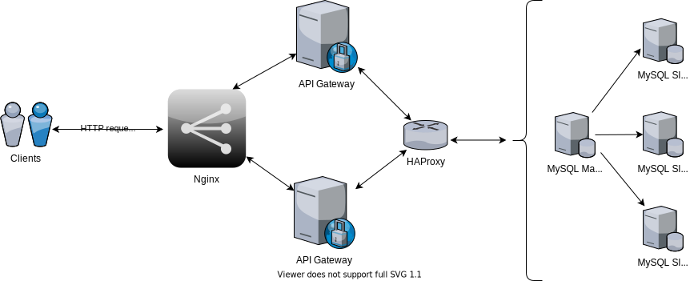

# Отчет по домашнему заданию "Отказоустойчивость приложений"

## Содержание

1. [ Задача ](#task)
2. [ Предисловие ](#foreword)
3. [ Инфраструктура ](#infrastructure)
4. [ Конфигурация окружения](#preparings)
    - [ Описание Docker-Compose конфигураций ](#docker-compose)
    - [ Конфигурация MySQL ](#mysql-conf)
    - [ Конфигурация HAProxy ](#haproxy-conf)
    - [ Конфигурация Nginx ](#nginx)
5. [ Тестирование ](#testing)
    - [ Запуск окружения ](#run-env)
    - [ После-стартовая проверка ](#after-start-check)
    - [ Запуск тестов ](#run-tests)
6. [ Итого ](#total)

<a name="task"></a>

## Задача

- Поднять несколько слейвов MySQL;
- Реализовать соединение со слейвами mysql через haproxy;
- Поднять несколько приложений и обеспечить их балансировку через nginx;
- Воспроизвести нагрузку;
- Под нагрузкой отключить один из слейвов MySQL. Убедится, что система осталась работоспособной;
- Под нагрузкой отключить один из инстансов бэкенда. Убедится, что система осталась работоспособной.

**Требования:**

- В отчете верно описана конфигурация haproxy;
- В отчете верно описана конфигурация nginx;
- В отчете верно описаны условия эксперимента;
- В отчете должны быть логи работы системы.

<a name="foreword"></a>

## Предисловие

Так уж получилось, что данное задание я практически выполнил во время работы над ДЗ "Semi-Sync репликации в MySQL".

После mongodb стало интересно мне, как это мускул возьмет да и кластеризуется, да при этом чтобы если master споткнется
и выпадет из обоймы чтоб нового master'а выбрали, да чтоб еще бесшовно и без отрыва от процесса.

Вот и запилил я mysql кластер, состоящий из одной master ноды и трех реплик с semi-sync репликацией данных.

Все это под ProxySQL с распределением запросов чтения/записи.

Самим кластером рулит Orchestrator, он же и производит выбор из доступных реплик, новой master ноды, если старый узел
приуныл.

Если интересно, то вот [детальный отчет по организации такой инфраструктуры](../replication/p2_semi_sync_replication.md)
.

Но так как данная задача про haproxy + необходима балансировка бэкенда через nginx, то ниже по тексту реализация.

<a name="infrastructure"></a>

## Инфраструктура



Инфраструктура состоит из

- **Nginx** - балансировщик и реверс-прокси для входящих http запросов;
- **API Gateway** бывшая точка входа, служит для аутентификации пользователей и авторизации запросов. На борту несет
  REST API. В комплекте два экземпляра, об них и будем масштабироваться;
- **HAProxy** балансировщик и реверс-прокси для mysql кластера;
- **MySQL кластер**, состоящий из одной master ноды и трех реплик.

<a name="preparings"></a>

## Конфигурация окружения

<a name="docker-compose"></a>

### Описание Docker-Compose конфигураций

- [docker-compose.haproxy.yml](../../docker-compose.haproxy.yml) - старт haproxy и mysql кластера;
- [docker-compose.cluster.yml](../../docker-compose.cluster.yml) - старт nginx и двух инстансов API Gateway сервиса.

<a name="mysql-conf"></a>

### Конфигурация MySQL

- [Конфигурация Master](../../deployment/cluster/mysql/master.cnf)
- [Конфигурация Slave01](../../deployment/cluster/mysql/slave1.cnf)
- [Конфигурация Slave02](../../deployment/cluster/mysql/slave2.cnf)
- [Конфигурация Slave03](../../deployment/cluster/mysql/slave3.cnf)

Реплика будет инициирована сервисом установщиком [firestarter](../../deployment/haproxy/Dockerfile).

В ходе его работы будет настроена semi-sync репликация и исполнены следующие SQL запросы:

Для **master**

```mysql
# Создаем пользователя репликации
CREATE USER '$REPL_USER'@'%' IDENTIFIED BY '$REPL_PASSWORD';
GRANT REPLICATION SLAVE ON *.* TO '$REPL_USER'@'%';

# Создаем пользователя для проверки доступности сервера бд со стороны haproxy
CREATE USER 'haproxy'@'%';
FLUSH PRIVILEGES;

# Устанавливаем и включаем плагин полу-синхронной репликации
INSTALL PLUGIN rpl_semi_sync_master SONAME 'semisync_master.so';
SET GLOBAL rpl_semi_sync_master_enabled = 1;
SET GLOBAL rpl_semi_sync_master_wait_for_slave_count = 3;
SET GLOBAL rpl_semi_sync_master_timeout = 5000
```

Для **реплик**

```mysql
# Указываем на master сервер и включаем репликацию
CHANGE MASTER TO MASTER_HOST ='master_db',MASTER_USER ='$REPL_USER',MASTER_PASSWORD ='$REPL_PASSWORD',MASTER_AUTO_POSITION =1;
START SLAVE;

# Устанавливаем и включаем плагин полу-синхронной репликации для slave
INSTALL PLUGIN rpl_semi_sync_slave SONAME 'semisync_slave.so';
SET GLOBAL rpl_semi_sync_slave_enabled = 1;
STOP SLAVE IO_THREAD;
START SLAVE IO_THREAD;

# Создаем пользователя для проверки доступности сервера бд со стороны haproxy
CREATE USER 'haproxy'@'%';
FLUSH PRIVILEGES;
```

<a name="haproxy-conf"></a>

### Конфигурация HAProxy

[haproxy.cfg](../../deployment/haproxy/haproxy.cfg):
```
global
    maxconn 500

defaults
    log     global
    option  tcplog
    option  dontlognull
    timeout connect 3s
    timeout client  50s
    timeout server  50s
    timeout check   2s

listen mysql-cluster
    mode tcp
    bind :3306
    option mysql-check user haproxy
    balance roundrobin
    server server01 ${NODE1} check inter 1s
    server server02 ${NODE2} check inter 1s
    server server03 ${NODE3} check inter 1s
    server server04 ${NODE4} check inter 1s
```

Как видно из конфигурации, в наличии четыре сервера БД, которые будут балансироваться через `roundrobin` алгоритм.

<a name="nginx"></a>

### Конфигурация Nginx

[nginx.conf](../../deployment/nginx/nginx.conf):
```
worker_processes  8;
worker_rlimit_nofile 8192;

events {
  worker_connections  4096;
}

http {
    upstream entrypoint {
        server node01:8080 fail_timeout=0;
        server node02:8080 fail_timeout=0;
    }

    server {
        listen 80;
        server_name localhost;
        location / {
            proxy_pass http://entrypoint;
            proxy_set_header Host $host;
            proxy_set_header X-Forwarded-Host $server_name;
            proxy_set_header X-Real-IP $remote_addr;
        }
    }
}
```

Точка входа будет доступна по адресу http://127.0.0.1:80. Под капотом происходит балансировка запросов между инстансами
API Gateway - node01 и node02.

<a name="testing"></a>

## Тестирование

<a name="run-env"></a>

### Запуск окружения

Собственно, всё уже готово к запуску. В консоли взываем к команде

> make upCluster

или

> sudo docker-compose -f docker-compose.cluster.yml -f docker-compose.haproxy.yml -f docker-compose.queue.yml up --build -d

И ждем. До кучи взлетят еще kafka с zookeeper. Увы API Gateway нуждается в шине данных для обмена событиями с
внутренними сервисами.

<a name="after-start-check"></a>

### После-стартовая проверка

**Проверяем взлет реплики**
> sudo docker logs firestarter

В выдаче увидим результаты выполнения команд `SHOW MASTER STATUS` и `SHOW SLAVE STATUS`.

Для мастера будет [что-то вроде этого](../replication/p2_semi_sync_replication.md#master-state).

Для реплик [что-то вроде этого](../replication/p2_semi_sync_replication.md#slave-state).

**Проверяем взлет Api Gateway**
> sudo docker logs node01
> sudo docker logs node02

Увидим, что оба сервиса взлетели и слушают порт `8080`.

**node01**

```
time="2021-03-16 14:06:25" level=info msg="implementing migrations"
time="2021-03-16 14:06:30" level=info msg="applied 2 migrations!"
time="2021-03-16 14:06:30" level=info msg="running http server..."
time="2021-03-16 14:06:30" level=info msg="http server started on port 8080"
```

Обращаю внимание, что на первой ноде будут запущены миграции, но проверять работу репликации мы будем ниже по тексту.

**Наполним БД записями и проверим работу реплик**

Засеиваем таблицу `users` одним миллионом пользователей, чтоб тесты пожарче были:
> make seed SEED_HOST=127.0.0.1:3336 SEED_USER=root SEED_PASS=rO0t3zRtga SEED_QTY=1000000

Проверяем master и slave ноды mysql:
> mysql --host 127.0.0.1 --port 3336 -uroot --password="rO0t3zRtga" otus_ha -e "select count(*) from users;"

> mysql --host 127.0.0.1 --port 3337 -uroot --password="rO0t3zRtga" otus_ha -e "select count(*) from users;"

> mysql --host 127.0.0.1 --port 3338 -uroot --password="rO0t3zRtga" otus_ha -e "select count(*) from users;"

> mysql --host 127.0.0.1 --port 3339 -uroot --password="rO0t3zRtga" otus_ha -e "select count(*) from users;"

Во всех случаях должны увидеть следующую выдачу:

```
+----------+
| count(*) |
+----------+
|  1000003 |
+----------+
```

<a name="run-tests"></a>

### Запуск тестов

Авторизируемся под пользователем `tester`:
> curl -XPOST http://127.0.0.1:80/v1/auth/sign-in -d '{"username":"tester", "password":"1234567890"}'

В ответ получаем JWT токен, который используем для авторизации запросов:

```json
{
  "object": "token",
  "token": "SOME_AUTH_JWT",
  "userId": 3,
  "username": "tester",
  "expiresAt": 1615907624
}
```

**Запускаем wrk тест**

Тест будет запущен для поиска пользователей по префиксам имени и фамилии.

Для рандомизации запроса будет задействован вспомогательный [lua скрипт](../../wrk/request.lua).

**Сперва прогоняем тест без аварий**
> wrk -t5 -c10 -d1m --timeout 30s -H "Authorization: Bearer: SOME_AUTH_JWT" -s ./request.lua http://127.0.0.1:80

Смотрим как отработало:

```
Running 1m test @ http://127.0.0.1:80
  5 threads and 10 connections
  Thread Stats   Avg      Stdev     Max   +/- Stdev
    Latency    15.95ms   26.38ms 383.35ms   89.86%
    Req/Sec   260.18    140.51   760.00     69.16%
  77630 requests in 1.00m, 31.72MB read
Requests/sec:   1291.88
Transfer/sec:    540.51KB
```

Проверяем логи `node01` и `node02` дабы убедиться, что nginx распределяет запросы по двум инстансам API Gateway:
> sudo docker logs node01

> sudo docker logs node02

В выдаче увидим логи http запросов.

**Запускаем тест и саботируем работу**
> wrk -t5 -c10 -d1m --timeout 60s -H "Authorization: Bearer: SOME_AUTH_JWT" -s ./request.lua http://127.0.0.1:80

Ждем какое-то время, и идем ломать мускул.

Останавливаем реплику `slave3_db`
> sudo docker stop slave3_db

Проверяем логи API Gateway.

Останавливаем две оставшиеся реплики
> sudo docker stop slave2_db slave1_db

Смотрим логи и видим, что запросы все еще идут и по ним отдаются успешные ответы.

Выпиливаем один из инстансов API Gateway:
> sudo docker stop node01

Проверяем лог `node01`:
> sudo docker logs node01

Видим, что он успешно слился:

```json
time="2021-03-16 14:20:10" level=info msg="received the terminated call, shutting down"
time="2021-03-16 14:20:10" level=info msg="shut down the http server"
time="2021-03-16 14:20:10" level=error msg="http: Server closed"
time="2021-03-16 14:20:10" level=info msg="server exited properly"
time="2021-03-16 14:20:10" level=info msg="closing producer"
time="2021-03-16 14:20:10" level=error msg="producer connection has been closed"
```

Проверяем логи `node02`. Видим, что она продолжает принимать запросы и отдавать ответы с status code 200.

Дожидаемся окончания теста:

```
Running 1m test @ http://127.0.0.1:80
  5 threads and 10 connections
  Thread Stats   Avg      Stdev     Max   +/- Stdev
    Latency    87.36ms  522.37ms   8.01s    97.31%
    Req/Sec   271.27    148.39     1.00k    66.71%
  68614 requests in 1.00m, 27.99MB read
  Non-2xx or 3xx responses: 11
Requests/sec:   1142.34
Transfer/sec:    477.24KB
```

Видим, что

- За все время работы получено всего 11 аварийных ответов. Скорее всего они пришлись на тот момент, когда
  балансировщики "отдуплялись" после падения реплик и `node01`;
- Балансировка отработала успешно,- выжившие экземпляры сервиса и master узел БД приняли на себя оставшуюся нагрузку,
  успешно отработав тест до конца.

**Смотрим логи HAProxy**

> sudo docker logs haproxy

```
[WARNING] 074/143237 (1) : config : log format ignored for proxy 'mysql-cluster' since it has no log address.
[NOTICE] 074/143237 (1) : New worker #1 (7) forked
[WARNING] 074/143539 (7) : Server mysql-cluster/server02 is DOWN, reason: Layer4 connection problem, info: "Connection refused", check duration: 0ms. 3 active and 0 backup servers left. 0 sessions active, 0 requeued, 0 remaining in queue.
[WARNING] 074/143539 (7) : Server mysql-cluster/server03 is DOWN, reason: Layer4 connection problem, info: "Connection refused", check duration: 0ms. 2 active and 0 backup servers left. 0 sessions active, 0 requeued, 0 remaining in queue.
[WARNING] 074/143554 (7) : Server mysql-cluster/server04 is DOWN, reason: Layer4 timeout, check duration: 1000ms. 1 active and 0 backup servers left. 3 sessions active, 0 requeued, 0 remaining in queue.
```

Отчетливо видно, как "прилегли" все три реплики.

<a name="total"></a>

## Итого

1. Процесс сборки и конфигурирования требуемой инфраструктуры - описан;
2. Настроена semi-sync MySQL репликация;
3. HAProxy успешно выступил балансировщиком на чтение между доступными MySQL узлами;
4. Nginx успешно выступил балансировщиком по входящим запросам для узлов API Gateway;
5. Нагрузочное тестирование проведено. Результаты тестирования приведены в отчете. По результатам видно, что
   инфраструктура показала определенную устойчивость к сбоям;
6. Логи HAProxy приведены.