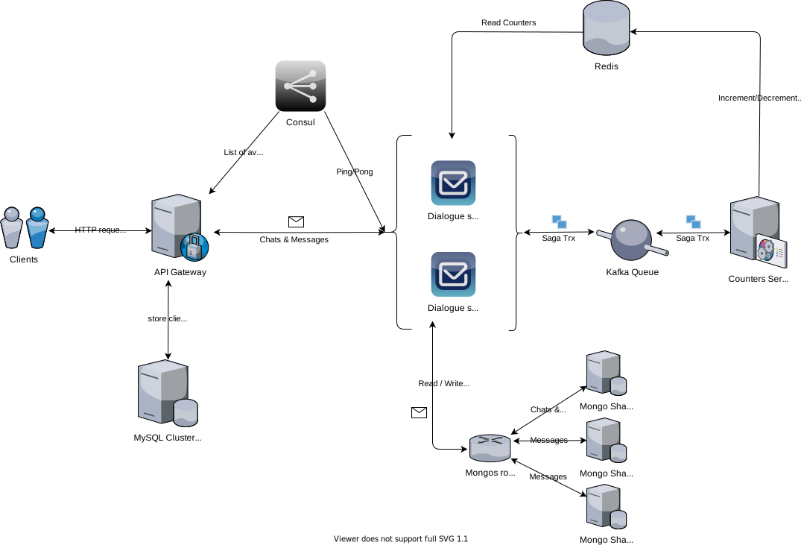

# Отчет по домашнему заданию "Сервис Счетчиков"

## Содержание

1. [ Задача ](#task)
2. [ Докеризация ](#dockerize-it)
3. [ Архитектура ](#architecture)
    - [ Сервис Диалогов ](#dialogue-service)
    - [ Сервис Счетчиков ](#counter-service)
    - [ Обеспечение консистентности ](#consistence)
4. [ Тестирование ](#testing)
    - [ Запуск ](#start-up)
    - [ Подготовка ](#prepearings)
    - [ Positive cases ](#positive-cases)
    - [ Negative case ](#negative-case)
    - [ Разбор Логов ](#logs)
4. [ Итого ](#total)

<a name="task"></a>

## Задача

- [x] [Разработайте Сервис Счетчиков](#counter-service);
- [x] [Учесть, что на сервис будет большая нагрузка, особенно на чтение](#read-highload);
- [x] [Обеспечить консистентность между счетчиком и реальным числом непрочитанных сообщений](#consistence);
- [x] [Внедрите сервис для отображения счетчиков](#positive-cases).

Требования:

- Верно [описан выбранный паттерн обеспечения консистентности](#consistence);
- [Выбранная архитектура](#architecture) сервиса подходит для решения задачи.

<a name="dockerize-it"></a>

### Докеризация

1. [docker-compose.dialogue.yml](../../docker-compose.dialogue.yml) - сервисы диалогов и счетчиков + mongo shared
   cluster;
2. [docker-compose.cache.yml](../../docker-compose.cache.yml) - просто redis;
3. [docker-compose.standalone.yml](../../docker-compose.standalone.yml) - Точка входа API Gateway в единичном экземпляре + обвязка из mysql, consul и web-интерфейса;
3. [docker-compose.queue.yml](../../docker-compose.queue.yml) - kafka + zookeeper.

<a name="architecture"></a>

## Архитектура



Описание диаграммы:

1. Все запросы от клиентов идут через единую точку входа, которая отвечает за аутентификацию пользователей и авторизацию
   запросов. Она так же умеет в горизонтальное масштабирование, попробовать можно через команду `upClluster`;
2. Запросы на работу с чатами и сообщениями идут в узлы Сервиса Диалогов. Consul выступает "хелзчекером" и поставщиком
   знаний о доступных узлах;
3. Сервис Диалогов использует Mongo Shared Cluster для хранения чатов и сообщений, при этом шардируются только
   сообщения;
4. Сервис Диалогов использует Redis для быстрого чтения счетчиков непросмотренных сообщений по определенному диалогу;
5. Сервис Диалогов также использует Redis для хранения незавершенных распределенных транзакций, ожидающих commit или
   rollback;
5. Сервис Диалогов использует Kafka с двумя топиками для осуществления распределенных транзакций с сервисом счетчиков;
6. Сервис Счетчиков служит для обновления счетчиков непросмотренных сообщений по диалогам;
7. Сервис Счетчиков получает через свой топик в Kafka сообщение об идущей распределенной транзакции;
8. В зависимости от типа транзакции Сервис Счетчиков производит операцию инкремента либо декремента указанного счетчика.
   Счетчик хранится в общем c Сервисом Диалогов Redis кэше;
9. Сервис Счетчиков отчитывается в Kafka топик Сервиса Диалогов о результатах выполнения своей части распределенной
   транзакции.

<a name="read-highload"></a>

По условию задачи необходимо было учесть возможную большую нагрузку по чтению на Сервис Счетчиков, и я ее таки учел,
полностью сняв ее с сервиса.

Вся нагрузка ляжет на Сервис Диалогов и на Redis. Если Сервис Диалогов начнет проседать по скорости отдачи, то счетчики
можно начать вычитывать отдельно от чатов, асинхронно читая их при помощи nginx прямиком из redis, а поможет в этом
модуль `ngx_http_redis_module`.

<a name="dialogue-service"></a>

### Сервис Диалогов

Сервис Диалогов, отвечает за взаимодействие и хранение данных по диалогам и сообщениям пользователей.

Так же сервис обогащает хранимые данные информацией о счетчиках непрочитанных сообщений, которая поставляется в redis
кэш Сервисом Счетчиков.

На стороне Сервиса Диалогов расположен оркестратор распределенных транзакций, служащий для поддержания актуального и
консистентного состояния счетчиков непрочитанных сообщений.

[Код Сервиса Диалогов](../../dialogue)

<a name="counter-service"></a>

### Сервис Счетчиков

Сервис с одной задачей — считать счетчики.

Изменение счетчика происходит только в рамках распределенной транзакции. Счетчики хранятся в разделяемом Redis кэше.

Сервисы потребители могут свободно считывать актуальные значения счетчиков из кэша.

[Код Сервиса Счетчиков](../../counter)

<a name="consistence"></a>

### Обеспечение консистентности

Для обеспечения консистентности данных и актуализации счетчиков непрочитанных сообщений используется Оркестрируемая
Сага.

Оркестратор Саги находится на стороне Сервиса Диалогов, т.к. он выступает инициатором и финализатром Саги.

[Код Saga Оркестратора](../../dialogue/saga)

Оркестратор распределенных транзакций нарублен топором, за что прошу пардону, сильно во времени ограничен был.

Изобретал колесо т.к. вменяемого готового opensource оркестратора под golang я не нашел. Видел две китайские подделки,
одна форк от другой, но обе работают в real-time, удерживая ресурсы, пока не отработают все участники саги.

Итак, имеем Оркестрируемую Сагу, для обеспечения консистентности распределенных транзакций между Сервисом Диалогов и
Сервисом Счетчиков.

Поддерживается три типа транзакций:

1. Компенсируемая — транзакция имеющая компенсирующую транзакцию;
2. Поворотная — транзакция завершающая текущую сагу;
3. Повторяемая — транзакция, которая будет упорно повторяться, пока не завершится успехом.

К созданию Саги приводят два вида запросов:

1. Запрос на создание сообщения;
2. Запрос на чтение сообщений.

#### Сага про создание сообщения

1. Сервис Диалогов пишет новое сообщение в персистентное хранилище (mongodb). Сообщение фиксируется с
   флагом `read = false`;
2. Оркестратор создает Сагу с **Повторяемой транзакцией** на инкремент счетчика для второго участника диалогов;
3. Объект Сага временно фиксируется в Redis, а транзакция пишется в Kafka, в топик Сервиса Счетчиков;
4. Сервис Счетчиков вычитывает транзакцию из топика и пытается инкрементировать счетчик непрочитанных сообщений по
   заданному диалогу для заданного пользователя;
5. В случае успеха:
    - Для транзакции вычитанной из топика Сервиса Счетчиков производится "ack", или в терминах Kafka - "commit";
    - Сервис Счетчиков меняет статус транзакции на успешный, и отправляет ее в Kafka топик Сервиса Диалогов.
6. Если Сервис Счетчиков потерпит неудачу на инкременте счетчика, то "commit" сообщения не произойдет, и сервис
   продолжит вычитывать это сообщение, пытаясь завершить транзакцию;
7. Сервис Диалогов вычитывает из своего топика транзакцию со статусом - "успех" и выполняет "commit" Саги, что завершает
   ее и удаляет запись из временного хранилища.

#### Сага про чтение непрочитанных

1. В Сервис Диалогов приходит запрос на чтение сообщений по чату X для пользователя Y;
2. Сервис Диалогов вычитывает для диалога X сообщения, количеством Limit от заданного Offset:
3. Клиент отпускается со списком сообщений в ответе;
4. Сервис Диалогов производит обход полученного списка сообщений, отбирая те, автором которых является собеседник
   пользователя Y, и имеющие флаг `read = false`;
5. Если непрочитанные сообщения найдены, то создается Сага;
6. Первой транзакцией в Сагу попадает **Компенсируемая Транзакция** на обновление у найденных сообщений `read` флага
   в `true`;
7. Сообщения обновляются в персистентном хранилище (mongodb);
8. В теле объекта Саги фиксируются данные транзакции, включая список ID отфильтрованных сообщений и количество
   затронутых обновлением документов;
9. Сага сохраняется в Redis, и в Kafka топик Сервиса Счетчиков пишется **Поворотная Транзакция** с декрементом счетчика
   на значение равное количеству обновленных документов;
10. Сервис Счетчиков получает транзакцию из Kafka и пробует обновить счетчик;
11. В случае успеха транзакция помечается как успешная, в случае провала как проваленная, после чего пишется в Kafka, в
    топик Сервиса Диалогов;
12. Сервис Диалогов вычитывает Поворотную Транзакцию из своего топика. Если транзакция успешная, то Сага завершается,
    запись о ней стирается из временного хранилища (redis);
13. Если транзакция провалена, то по Саге инициируется rollback-процедура, которая выполняет компенсацию по **
    Компенсируемой Транзакции**. В данном случае возвращает всем измененным сообщениям флаг `read` в `false`.

<a name="testing"></a>

## Тестирование

<a name="start-up"></a>

### Запуск

**1. Только самое необходимое + web-интерфейс**

Запуск:
> make upSagaDialogue

или

> sudo docker-compose -f docker-compose.dialogue.yml -f docker-compose.cache.yml -f docker-compose.standalone.yml -f docker-compose.queue.yml up --build -d


Останов:
> make downSagaDialogue

или

> sudo docker-compose -f docker-compose.dialogue.yml -f docker-compose.cache.yml -f docker-compose.standalone.yml -f docker-compose.queue.yml down -v

**2. С прочими спец. дефектами**

Запуск:
> make upFull

Останов:
> make downFull

**3. В составе кластера**

Запуск:
> make upCluster

Останов:
> make downCluster

<a name="prepearings"></a>

### Подготовка

**1. Создадим пользователя с которым будем общаться**

Запрос:
> curl -XPOST http://127.0.0.1:8007/v1/auth/sign-up -d '{"username":"tester1", "password":"1234567890", "passwordConfirm":"1234567890", "gender":"m"}'

Ответ:

```json
{
  "object": "token",
  "token": "eyJhb...1XZW8",
  "userId": 4,
  "username": "tester1",
  "expiresAt": 1616662539
}
```

Сохраним полученный для `tester1` авторизационный токен.

**2. Авторизируемся под `tester`**

Запрос:
> curl -XPOST http://127.0.0.1:8007/v1/auth/sign-in -d '{"username":"tester", "password":"1234567890"}'

Ответ:

```json
{
  "object": "token",
  "token": "eyJhb...A3MQg",
  "userId": 3,
  "username": "tester",
  "expiresAt": 1616662567
}
```

Сохраним полученный для `tester1` авторизационный токен.

<a name="positive-cases"></a>

### Positive cases

В данном разделе мы создадим чат, поперекидываемся сообщениями между `tester` и `tester1`, посмотрим как меняются
счетчики непрочитанных сообщений, и как реагируют сервисы в штатном режиме работы.

**1. Под пользователем `tester` создаем диалог**

Запрос:

> curl -XPOST http://127.0.0.1:8007/v1/chats -d '{"users":[3, 4]}' -H "Authorization:Bearer eyJhb...A3MQg"

Ответ:

```json
{
  "object": "chat",
  "id": "605c42396e1aaa81e0b66cb5",
  "users": [3, 4],
  "unread": 0,
  "createdAt": 1616659001
}
```

**2. От `tester` напишем два сообщения пользователю `tester1`**

Запрос 1:

> curl -XPOST http://127.0.0.1:8007/v1/chats/605c42396e1aaa81e0b66cb5/messages -d '{"txt":"Hello tester1. Im tester"}' -H "Authorization:Bearer eyJhb...A3MQg"

Ответ 1:

```json
{
  "object": "message",
  "id": "605c42566e1aaa81e0b66cb6",
  "cid": "605c42396e1aaa81e0b66cb5",
  "uid": 3,
  "createdAt": 1616659030,
  "text": "Hello tester1. Im tester"
}
```

Запрос 2:

> curl -XPOST http://127.0.0.1:8007/v1/chats/605c42396e1aaa81e0b66cb5/messages -d '{"txt":"How are you?"}' -H "Authorization:Bearer eyJhb...A3MQg"

Ответ 2:

```json
{
  "object": "message",
  "id": "605c42566e1aaa81e0b66cb7",
  "cid": "605c42396e1aaa81e0b66cb5",
  "uid": 3,
  "createdAt": 1616659030,
  "text": "How are you?"
}
```

**3. Проверим счетчик сообщений для `tester`**

Счетчик непрочитанных сообщений по чату должен быть равен 0 для `tester`, т.к. это автор сообщений.

Запрос:
> curl http://127.0.0.1:8007/v1/chats/605c42396e1aaa81e0b66cb5 -H "Authorization:Bearer eyJhb...A3MQg"

Ответ:

```json
{
  "object": "chat",
  "id": "605c42396e1aaa81e0b66cb5",
  "users": [3, 4],
  "unread": 0,
  "createdAt": 1616659001
}
```

Счетчик равен 0, как и должно быть.

**4. Напишем сообщение от `tester1` к `tester`**

Запрос:
> curl -XPOST http://127.0.0.1:8007/v1/chats/605c42396e1aaa81e0b66cb5/messages -d '{"txt":"Hi! Im fine, thank you my man!"}' -H "Authorization:Bearer eyJhb...1XZW8"

Ответ:

```json
{
  "object": "message",
  "id": "605c42776e1aaa81e0b66cb8",
  "cid": "605c42396e1aaa81e0b66cb5",
  "uid": 4,
  "createdAt": 1616659063,
  "text": "Hi! Im fine, thank you my man!"
}
```

**5. Проверим счетчики для обоих пользователей**

Запрос информации по диалогу под `tester1`:
> curl http://127.0.0.1:8007/v1/chats/605c42396e1aaa81e0b66cb5 -H "Authorization:Bearer eyJhb...1XZW8"

Ответ:

```json
{
  "object": "chat",
  "id": "605c42396e1aaa81e0b66cb5",
  "users": [3, 4],
  "unread": 2,
  "createdAt": 1616659001
}
```

Запрос списка диалогов под `tester1`:
> curl http://127.0.0.1:8007/v1/chats -H "Authorization:Bearer eyJhb...1XZW8"

Ответ:

```json
{
  "object": "list",
  "data": [
    {
      "object": "chat",
      "id": "605c42396e1aaa81e0b66cb5",
      "users": [3, 4],
      "unread": 2,
      "createdAt": 1616659001
    }
  ]
}
```

**Обращаем внимание**, что у диалога счетчик непрочитанных сообщений для `tester1` равен **двум**.

Запрос информации по диалогу под `tester`:
> curl http://127.0.0.1:8007/v1/chats/605c42396e1aaa81e0b66cb5 -H "Authorization:Bearer eyJhb...A3MQg"

Ответ:

```json
{
  "object": "chat",
  "id": "605c42396e1aaa81e0b66cb5",
  "users": [3, 4],
  "unread": 1,
  "createdAt": 1616659001
}
```

**Обращаем внимание**, что у диалога счетчик непрочитанных сообщений для `tester` равен **единице**.

Количество непрочитанных сообщений **посчитано корректно** для обоих пользователей.

**6. Прочитаем сообщения и декрементируем счетчик для `tester1`**

Запрос:
> curl http://127.0.0.1:8007/v1/chats/605c42396e1aaa81e0b66cb5/messages -H "Authorization:Bearer eyJhb...1XZW8"

Ответ:

```json
{
  "object": "list",
  "data": [
    {
      "object": "message",
      "id": "605c42776e1aaa81e0b66cb8",
      "cid": "605c42396e1aaa81e0b66cb5",
      "uid": 4,
      "createdAt": 1616659063,
      "text": "Hi! Im fine, thank you my man!"
    },
    {
      "object": "message",
      "id": "605c42566e1aaa81e0b66cb7",
      "cid": "605c42396e1aaa81e0b66cb5",
      "uid": 3,
      "createdAt": 1616659030,
      "text": "How are you?"
    },
    {
      "object": "message",
      "id": "605c42566e1aaa81e0b66cb6",
      "cid": "605c42396e1aaa81e0b66cb5",
      "uid": 3,
      "createdAt": 1616659030,
      "text": "Hello tester1. Im tester"
    }
  ]
}
```

**7. Проверим счетчик непрочитанных сообщений для `tester1`**

Запрос:
> curl http://127.0.0.1:8007/v1/chats/605c42396e1aaa81e0b66cb5 -H "Authorization:Bearer eyJhb...1XZW8"

Ответ:

```json
{
  "object": "chat",
  "id": "605c42396e1aaa81e0b66cb5",
  "users": [3, 4],
  "unread": 0,
  "createdAt": 1616659001
}
```

Как видим, **после прочтения** всех сообщений, **счетчик был декрементирован** до **нуля**.

<a name="negative-case"></a>

### Negative case

В данном разделе будет воссоздана аварийная ситуация, которая приведет к провалу Саги и выполнению компенсирующей
транзакции.

**1. Отправим сообщение от `tester1` к `tester`**

Запрос:
> curl -XPOST http://127.0.0.1:8007/v1/chats/605c42396e1aaa81e0b66cb5/messages -d '{"txt":"Fail message!"}' -H "Authorization:Bearer eyJhb...1XZW8"

Ответ:

```json
{
  "object": "message",
  "id": "605c42c26e1aaa81e0b66cb9",
  "cid": "605c42396e1aaa81e0b66cb5",
  "uid": 4,
  "createdAt": 1616659138,
  "text": "Fail message!"
}
```

**2. Уроним кафку**

> sudo docker stop kafka

**3. Запросим информацию по чату под `tester`**

Запрос:
> curl http://127.0.0.1:8007/v1/chats/605c42396e1aaa81e0b66cb5 -H "Authorization:Bearer eyJhb...A3MQg"

Ответ:

```json
{
  "object": "chat",
  "id": "605c42396e1aaa81e0b66cb5",
  "users": [3, 4],
  "unread": 2,
  "createdAt": 1616659001
}
```

Счетчик **непрочитанных** сообщений равен **двум**, что верно, т.к. мы **еще не читали** сообщения под `tester`

**4. Запросим список сообщений для пользователя `tester`**

Напоминаю, что данная операция должна вызвать декремент счетчика по чату для `tester`.

Запрос:
> curl http://127.0.0.1:8007/v1/chats/605c42396e1aaa81e0b66cb5/messages -H "Authorization:Bearer eyJhb...A3MQg"


Ответ:

```json
{
  "object": "list",
  "data": [
    {
      "object": "message",
      "id": "605c42c26e1aaa81e0b66cb9",
      "cid": "605c42396e1aaa81e0b66cb5",
      "uid": 4,
      "createdAt": 1616659138,
      "text": "Fail message!"
    },
    ...,
    {
      "object": "message",
      "id": "605c42566e1aaa81e0b66cb6",
      "cid": "605c42396e1aaa81e0b66cb5",
      "uid": 3,
      "createdAt": 1616659030,
      "text": "Hello tester1. Im tester"
    }
  ]
}
```

**5. Еще раз запросим информацию по чату под `tester`**

Запрос:
> curl http://127.0.0.1:8007/v1/chats/605c42396e1aaa81e0b66cb5 -H "Authorization:Bearer eyJhb...A3MQg"

Ответ:

```json
{
  "object": "chat",
  "id": "605c42396e1aaa81e0b66cb5",
  "users": [3, 4],
  "unread": 2,
  "createdAt": 1616659001
}
```

Счетчик **непрочитанных** сообщений равен **двум**, что в данной ситуации является верным значением, т.к. кафка приуныла
и Сервису Счетчиков неоткуда узнать про Сагу.

**Проверим, что была выполнена Компенсирующая транзакция**

Напоминаю, что компенсирующая транзакция должна вернуть флаг read в значение false везде, где он был изменен при старте
Саги.

Для этого идем в mongo

> sudo docker exec -it mongoRouter mongo
> mongos> use otus_ha
> mongos> db.messages.find({aid:{$ne:3}}).pretty()

Получаем список всех сообщений, адресованных `tester` (ID:3):

```
{
        "_id" : ObjectId("605c42776e1aaa81e0b66cb8"),
        "cid" : ObjectId("605c42396e1aaa81e0b66cb5"),
        "aid" : 4,
        "ts" : NumberLong(1616659063),
        "txt" : "Hi! Im fine, thank you my man!",
        "rdn" : false
}
{
        "_id" : ObjectId("605c42c26e1aaa81e0b66cb9"),
        "cid" : ObjectId("605c42396e1aaa81e0b66cb5"),
        "aid" : 4,
        "ts" : NumberLong(1616659138),
        "txt" : "Fail message!",
        "rdn" : false
}
```

Видим что `read` флаг (`rdn`) остался в состоянии `false` что свидетельствует об успешно прошедшей компенсирующей
транзакции.

**Проверим, что все саги завершились**

Для этого зайдем в Redis и удостоверимся, что в наличии только ключи счетчиков:
> sudo docker redis redis-cli
> 127.0.0.1:6379> keys *

```
1) "cnt:605c42396e1aaa81e0b66cb5:4"
2) "cnt:605c42396e1aaa81e0b66cb5:3"
```

<a name="logs"></a>

### Разбор Логов

#### Читаем логи Сервиса Диалогов

> sudo docker logs dialogue01
> sudo docker logs dialogue02

**Part 1 - Positive Cases**

```
2021/03/25 07:56:41 [1cc8345c8e55/Fpc3cKNalU-000003] "POST http://dialogue01:8080/chats HTTP/1.1" from 192.168.32.6:39666 - 200 112B in 33.500886ms
2021/03/25 07:57:10 [1cc8345c8e55/Fpc3cKNalU-000004] "POST http://dialogue01:8080/messages HTTP/1.1" from 192.168.32.6:39666 - 200 137B in 8.798914ms
time="2021-03-25 07:57:10" level=info msg="publishing trx for saga new-msg:41975004"
2021/03/25 07:57:10 [1cc8345c8e55/Fpc3cKNalU-000005] "POST http://dialogue01:8080/messages HTTP/1.1" from 192.168.32.6:39666 - 200 131B in 3.482686ms
time="2021-03-25 07:57:10" level=info msg="publishing trx for saga new-msg:66164140"
time="2021-03-25 07:57:12" level=info msg="got trx for saga new-msg:41975004"
time="2021-03-25 07:57:12" level=info msg="committing saga new-msg:41975004"
time="2021-03-25 07:57:12" level=info msg="saga new-msg:41975004 has been committed"
time="2021-03-25 07:57:12" level=info msg="got trx for saga new-msg:66164140"
time="2021-03-25 07:57:12" level=info msg="committing saga new-msg:66164140"
time="2021-03-25 07:57:12" level=info msg="saga new-msg:66164140 has been committed"
...
2021/03/25 07:57:43 [1cc8345c8e55/Fpc3cKNalU-000007] "POST http://dialogue01:8080/messages HTTP/1.1" from 192.168.32.6:39666 - 200 146B in 1.354557ms
time="2021-03-25 07:57:43" level=info msg="publishing trx for saga new-msg:413100542"
time="2021-03-25 07:57:45" level=info msg="got trx for saga new-msg:413100542"
time="2021-03-25 07:57:45" level=info msg="committing saga new-msg:413100542"
time="2021-03-25 07:57:45" level=info msg="saga new-msg:413100542 has been committed"

```

- Успешный запрос на создание чата;
- Три успешных запроса на создание сообщений;
- Создается и публикуется сага `new-msg:41975004` на инкремент счетчиков по первому сообщению;
- Создается и публикуется сага `new-msg:66164140` на инкремент счетчиков по второму сообщению;
- Создается и публикуется сага `new-msg:413100542` на инкремент счетчиков по третьему сообщению;
- Транзакции по всем сагам успешно выполнены на стороне Сервиса Счетчиков, результаты получены с trx из kafka;
- Все саги успешно завершены - "committed".

**Part 2 - Positive Cases**

```
2021/03/25 07:58:26 [1cc8345c8e55/Fpc3cKNalU-000011] "GET http://dialogue01:8080/messages?uid=4&cid=605c42396e1aaa81e0b66cb5&limit=100 HTTP/1.1" from 192.168.32.6:39666 - 200 210B in 5.205098ms
time="2021-03-25 07:58:26" level=info msg="publishing trx for saga read-msg-875652493"
time="2021-03-25 07:58:28" level=info msg="got trx for saga read-msg-875652493"
time="2021-03-25 07:58:28" level=info msg="committing saga read-msg-875652493"
time="2021-03-25 07:58:28" level=info msg="saga read-msg-875652493 has been committed"
```

- Успешный запрос на чтение сообщений;
- Создается и публикуется сага `read-msg-875652493` на декремент счетчиков;
- Ловим результаты поворотной транзакции из очереди;
- Завершаем сагу.

**Part 3 - Negative Cases**

```
2021/03/25 07:58:58 [1cc8345c8e55/Fpc3cKNalU-000013] "POST http://dialogue01:8080/messages HTTP/1.1" from 192.168.32.6:39666 - 200 128B in 4.368724ms
time="2021-03-25 07:58:58" level=info msg="publishing event for saga new-msg:440911690"
time="2021-03-25 07:59:00" level=info msg="got event for saga new-msg:440911690"
time="2021-03-25 07:59:00" level=info msg="committing saga new-msg:440911690"
time="2021-03-25 07:59:00" level=info msg="saga new-msg:440911690 has been committed"
...
2021/03/25 07:59:58 [1cc8345c8e55/Fpc3cKNalU-000015] "GET http://dialogue01:8080/messages?uid=3&cid=605c42396e1aaa81e0b66cb5&limit=100 HTTP/1.1" from 192.168.32.6:39666 - 200 233B in 2.20493ms
time="2021-03-25 07:59:58" level=info msg="publishing event for saga read-msg-376685567"
time="2021-03-25 07:59:59" level=info msg="rolling back saga read-msg-376685567"
time="2021-03-25 07:59:59" level=info msg="saga read-msg-376685567 has been rolled back"
time="2021-03-25 07:59:59" level=error msg="failed to execute saga" error="kafka write errors (1/1)"
```

- Успешный запрос на создание Fail сообщения;
- Успешно отрабатывает сага `new-msg:440911690`;
- Успешный запрос на чтение списка сообщений;
- Создается сага `read-msg-376685567`, но откатывается из-за невозможности публикации транзакции в очередь.

#### Читаем логи Сервиса Счетчиков

> sudo docker logs counter

```
time="2021-03-25 07:57:11" level=info msg="got event for saga new-msg:41975004"
time="2021-03-25 07:57:11" level=info msg="publish commit for saga new-msg:41975004"
time="2021-03-25 07:57:11" level=info msg="got event for saga new-msg:66164140"
time="2021-03-25 07:57:11" level=info msg="publish commit for saga new-msg:66164140"
time="2021-03-25 07:57:44" level=info msg="got event for saga new-msg:413100542"
time="2021-03-25 07:57:44" level=info msg="publish commit for saga new-msg:413100542"
time="2021-03-25 07:58:27" level=info msg="got event for saga read-msg-875652493"
time="2021-03-25 07:58:27" level=info msg="publish commit for saga read-msg-875652493"
time="2021-03-25 07:58:59" level=info msg="got event for saga new-msg:440911690"
time="2021-03-25 07:58:59" level=info msg="publish commit for saga new-msg:440911690"
```

Видим по каким сагам прилетали транзакции, и по каким был опубликован результат.

<a name="total"></a>

## Итого

- [Сервис счетчиков разработан](#counter-service);
- [При разработке сервиса была учтена возможная большая нагрузка на чтение](#read-highload);
- [Обеспечена консистентность между счетчиком и реальным числом непрочитанных сообщений](#consistence);
- [Внедрен сервис для отображения счетчиков](#positive-cases).

В данной реализации представлен один узел Сервиса Счетчиков, который разбирает транзакции из очереди, работая с одной
партицией.

В случае необходимости в горизонтальном масштабировании Сервиса Счетчиков, необходимо докинуть в топик партиций по числу
узлов сервиса.

Операции increment/decrement в Redis атомарны, так что проблем с гонками быть не должно.

В случае падения одного из узлов Сервиса Счетчиков партиция может остаться без слушателя. Чтобы этого избежать,
необходимо поднять N+1 узлов сервиса, где N число партиций в топике сервиса. В таком случае простаивающий узел заменит
выбывший.