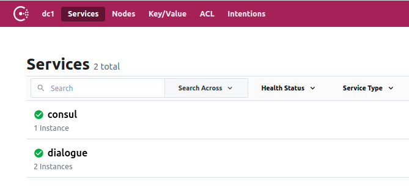
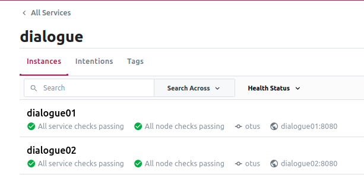
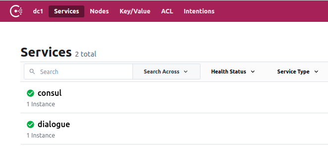

# Отчет по домашнему заданию "Отказоустойчивость приложений"

## Содержание

1. [ Задача ](#task)
2. [ Docker контейнеризация ](#docker)
    - [ Сервис очередей  ](#queue-service)
    - [ Backend API Gateway ](#backend-api)
    - [ Сервис Диалогов ](#dialogue-service)
3. [ Auto discovery ](#auto-discovery)
4. [ Учим монолит находить и грузить ](#health-checks-n-balancer)
5. [ Тестирование ](#testing)
6. [ Добавление новых экземпляров ](#new-node)
7. [ Итого ](#total)

<a name="task"></a>

## Задача

- [x] [Обернуть сервис диалогов в docker](#docker);
- [x] [Развернуть consul в вашей системе](#backend-api);
- [x] [Интегрировать auto discovery в систему диалогов](#auto-discovery);
- [x] [Научить монолитное приложение находить и равномерно нагружать все поднятые узлы сервиса диалогов](#health-checks-n-balancer)
  ;
- [ ] Опционально можно использовать nomad.

Требования:

- [Верно настроен docker](#docker);
- [Обеспечено распределение нагрузки по экземплярам сервиса](#check-load-balancing);
- [Описан процесс развертки новых экземпляров](#new-node).

<a name="docker"></a>

## Docker контейнеризация

Все сервисы участвующие в данной сборке, запускаются внутри Docker контейнеров.

Сервисы инкапсулируются в рамках их внутренних сетей при запуске через docker-compose.

<a name="queue-service"></a>

### Сервис очередей

[docker-compose.queue.yml](../../docker-compose.queue.yml)

- zookeeper, официальный образ zookeeper:3.6.1, централизованная служба координации инстансов kafka
- kafka, образ wurstmeister/kafka:2.13-2.7.0, очередь сообщений

**Networks:**

- queue, подсеть очереди.

<a name="backend-api"></a>

### Backend API Gateway

[docker-compose.standalone.yml](../../docker-compose.standalone.yml)

- mysql, официальный образ mysql:8.0.22. В данном примере будет использован один инст мускула;
- **consul**, официальный образ consul:1.9.4;
- backend, [Dockerfile](../../backend/Dockerfile), Точка входа для внешних клиентов;
- frontend, [Dockerfile](../../frontend/Dockerfile), Web клиент.

**Networks:**

- queue, external: true, импортируема подсеть очереди;
- inner, подсеть для общения сервисов.

<a name="dialogue-service"></a>

### Сервис Диалогов

[docker-compose.dialogue.yml](../../docker-compose.dialogue.yml)

- mongo01Mstr ... mongo03Mstr и mongo01Repl ... mongo03Repl, официальный образ mongo:4.4.3, три шарда master + replica в
  mongo кластере;
- mongoConfig и mongoRouter, официальный образ mongo:4.4.3, сервер конфигурации кластера и сервер маршрутизации запросов
  по кластеру;
- sharder, [Dockerfile](../../deployment/sharedCluster/Dockerfile), сервис после-стартовой настройки mongo кластера;
- dialogue01 и dialogue01, [Dockerfile](../../dialogue/Dockerfile), инстансы сервиса диалогов.

**Networks:**

- dlg, подсеть сервиса диалогов;
- inner, external: true, импортированная подсеть для общения сервисов.

Запускается все это командой
> make upWithConsul

или

> sudo docker-compose -f docker-compose.dialogue.yml -f docker-compose.standalone.yml -f docker-compose.queue.yml up --build -d


<a name="auto-discovery"></a>

## Auto discovery

Заранее подкладывать в консул конфигурацию с доступными сервисами я не стал. Вместо этого каждый узел сервиса диалогов
сам регистрирует себя в консуле через API Consul.

При остановке сервис пытается провести обратный процесс.

Реализация в коде

- [Методы регистрации и де-регистрации](../../dialogue/consul/consul.go);
- [Регистрация сервиса при старте сервера](../../dialogue/server/server.go#L83)

Сервисы несут на борту открытый ping роут, по которому консул простукивает хелзчеки.

<a name="health-checks-n-balancer"></a>

## Учим монолит находить и грузить

Теперь необходимо подружить сервис Backend с несколькими узлами сервиса диалогов, да так, чтобы он

1. понимал, какие узлы сейчас доступны;
2. равномерно распределял запросы по всем узлам.

Для этого через API Consul сервис Backend будет регулярно получать и актуализировать у себя список живых узлов.

На отправке запроса к Dialogue Service, при помощи алгоритма round robin, будет выбираться доступный сервис.

**Реализация в коде**

- [Актуализация доступных узлов](../../backend/balancer/service.go#L42)
- [Выбор узла и отправка запроса](../../backend/providers/dialogue/dialogue.go#L25)

<a name="testing"></a>

## Тестирование

**Запускаем проект:**
> make upWithConsul


**Проверяем, что сервисы `dialogue01` и `dialogue02` взлетели:**
> sudo docker logs dialogue01

Увидим что сервис стартовал на порту 8080 и его уже опрашивает консул:

```
time="2021-03-18 09:49:02" level=info msg="registering service at consul"
time="2021-03-18 09:49:02" level=info msg="http server listening on port 8080"
2021/03/18 09:49:06 [a1d3485c89f2/SjOTDok14n-000001] "GET http://dialogue01:8080/ping HTTP/1.1" from 172.28.0.4:52742 - 200 28B in 593.41µs
2021/03/18 09:49:11 [a1d3485c89f2/SjOTDok14n-000002] "GET http://dialogue01:8080/ping HTTP/1.1" from 172.28.0.4:52944 - 200 28B in 1.286922ms
```

**Заходим в GUI консула** по адресу http://127.0.0.1:8500, и видим, что оба узла сервиса диалогов определены и доступны:





**Авторизируемся в backend сервисе:**
> curl -XPOST http://127.0.0.1:8007/v1/auth/sign-in -d '{"username":"tester", "password":"1234567890", "passwordConfirm":"1234567890", "gender":"m"}'

Берем из ответа авторизационный токен:

```json
{
  "object": "token",
  "token": "SOME_AUTH_JWT",
  "userId": 3,
  "username": "tester",
  "expiresAt": 1616062453
}
```

**Создаем чат с собеседником под id 1:**
> curl -XPOST http://127.0.0.1:8007/v1/chats -d '{"users":[1, 3]}' -H "Authorization:Bearer SOME_AUTH_JWT"

Ответ:

```json
{
  "object": "chat",
  "id": "6053226593a589ae6ea95771",
  "users": [
    1,
    3
  ],
  "createdAt": 1616061029
}
```

**Пишем сообщение №1:**
> curl -XPOST http://127.0.0.1:8007/v1/chats/6053226593a589ae6ea95771/messages -d '{"txt":"Hi there"}' -H "Authorization:Bearer SOME_AUTH_JWT"

Ответ:

```json
{
  "object": "message",
  "id": "60532279673f87f8e2262ba7",
  "cid": "6053226593a589ae6ea95771",
  "uid": 3,
  "createdAt": 1616061049,
  "text": "Hi there"
}
```

**Пишем сообщение №1:**
> curl -XPOST http://127.0.0.1:8007/v1/chats/6053226593a589ae6ea95771/messages -d '{"txt":"How are you?"}' -H "Authorization:Bearer SOME_AUTH_JWT"

Ответ:

```json
{
  "object": "message",
  "id": "6053229293a589ae6ea95772",
  "cid": "6053226593a589ae6ea95771",
  "uid": 3,
  "createdAt": 1616061074,
  "text": "How are you?"
}
```

**Считываем все сообщения из чата**
> curl -XGET http://127.0.0.1:8007/v1/chats/6053226593a589ae6ea95771/messages -H "Authorization:Bearer SOME_AUTH_JWT"

Ответ:

```json
{
  "object": "list",
  "data": [
    {
      "object": "message",
      "id": "6053229293a589ae6ea95772",
      "cid": "6053226593a589ae6ea95771",
      "uid": 3,
      "createdAt": 1616061074,
      "text": "How are you?"
    },
    {
      "object": "message",
      "id": "60532279673f87f8e2262ba7",
      "cid": "6053226593a589ae6ea95771",
      "uid": 3,
      "createdAt": 1616061049,
      "text": "Hi there"
    }
  ]
}
```

**Считываем список чатов**
> curl -XGET http://127.0.0.1:8007/v1/chats -H "Authorization:Bearer SOME_AUTH_JWT"

Ответ:

```json
{
  "object": "list",
  "data": [
    {
      "object": "chat",
      "id": "6053226593a589ae6ea95771",
      "users": [
        1,
        3
      ],
      "createdAt": 1616061029
    }
  ]
}
```

<a name="check-load-balancing"></a>
**Смотрим логи для узлов сервиса диалогов**
> sudo docker logs dialogue01

```
2021/03/18 09:50:30 [dadd29e00cae/iNtUaRvhZ6-000002] "POST http://dialogue01:8080/chats HTTP/1.1" from 172.28.0.7:40534 - 200 106B in 43.453102ms
2021/03/18 09:51:14 [dadd29e00cae/iNtUaRvhZ6-000004] "POST http://dialogue01:8080/messages HTTP/1.1" from 172.28.0.7:40534 - 200 131B in 2.085202ms
2021/03/18 09:51:38 [dadd29e00cae/iNtUaRvhZ6-000006] "GET http://dialogue01:8080/chats?uid=3&limit=100 HTTP/1.1" from 172.28.0.7:40534 - 200 120B in 2.375316ms
```

> sudo docker logs dialogue02

```
2021/03/18 09:50:49 [dadd29e00cae/iNtUaRvhZ6-000003] "POST http://dialogue02:8080/messages HTTP/1.1" from 172.28.0.7:45182 - 200 134B in 3.891688ms
2021/03/18 09:51:30 [dadd29e00cae/iNtUaRvhZ6-000005] "GET http://dialogue02:8080/messages?uid=3&cid=6053226593a589ae6ea95771&limit=100 HTTP/1.1" from 172.28.0.7:45182 - 200 175B in 1.713313ms
```

Видим, что запросы равномерно распределяются по узлам.

Судя по всему, следующий запрос должен прийтись на узел `dialogue02`. Давайте уроним его и посмотрим что произойдет.

**Роняем узел `dialogue02`:**
> sudo docker stop dialogue02

**Проверяем логи:**
> sudo docker logs dialogue02

```
time="2021-03-18 09:53:24" level=info msg="received the terminated call, shutting down"
time="2021-03-18 09:53:24" level=info msg="shut down the http server"
time="2021-03-18 09:53:24" level=info msg="disconnecting from the DB..."
time="2021-03-18 09:53:24" level=info msg="DB connection has been closed"
```

Узел `dialogue02` успешно отстрелился.

**Проверим панель Консула:**



Видим, что доступен только узел dialogue01

**Запросим списки чатов и сообщений у backend:**
> curl -XGET http://127.0.0.1:8007/v1/chats -H "Authorization:Bearer SOME_AUTH_JWT"

> curl -XGET http://127.0.0.1:8007/v1/chats/6053226593a589ae6ea95771/messages -H "Authorization:Bearer SOME_AUTH_JWT"

Получим всё те же ответы.

**Проверим логи dialogue01:**

```
2021/03/18 09:54:05 [dadd29e00cae/iNtUaRvhZ6-000007] "GET http://dialogue01:8080/chats?uid=3&limit=100 HTTP/1.1" from 172.28.0.7:43484 - 200 120B in 2.644435ms
2021/03/18 10:09:09 [dadd29e00cae/iNtUaRvhZ6-000008] "GET http://dialogue01:8080/messages?uid=3&cid=6053226593a589ae6ea95771&limit=100 HTTP/1.1" from 172.28.0.7:54972 - 200 175B in 10.72724ms
```

Топология перестроилась, backend теперь шлет запросы исключительно в первый узел.

<a name="new-node"></a>

## Добавление новых экземпляров

Для добавления нового экземпляра достаточно развернуть и запустить на незанятом порту новый узел сервиса диалогов.

При запуске необходимо задать уникальными следующие переменные окружения:

- SERVICE_ID: "dialogueN", идентификатор сервиса;
- SERVICE_HOST: "http://dialogueN", хост по которому доступен новый узел внутри сети.

При запуске сервис сам добавит себя в Consul, после чего монолит в лице backend сервиса увидит новый узел, и добавит его
в балансировку запросов.

<a name="total"></a>

## Итого

- Все сервисы обернуты в Docker контейнеры. Вся топология билдится и взлетает одной командой;
- развернут и настроен Consul;
- реализован auto-discovering узлов сервиса диалогов;
- Монолит находит узлы и равномерно грузит их;
- Описан процесс добавления новых экземпляров сервиса диалогов.
