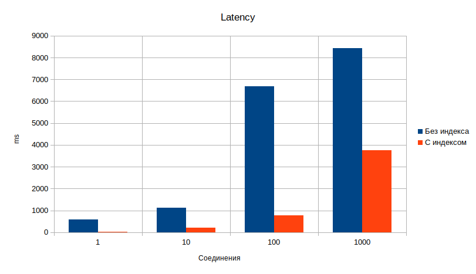
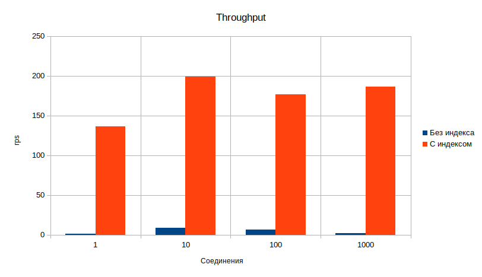

# Отчет по HW#3 Индексы

## Задача
1) Сгенерировать любым способ 1,000,000 анкет. Имена и Фамилии должны быть реальными (чтобы учитывать селективность индекса)
2) Реализовать функционал поиска анкет по префиксу имени и фамилии (одновременно) в вашей социальной сети (запрос в форме firstName LIKE ? and secondName LIKE ?). Сортировать вывод по id анкеты. Использовать InnoDB движок.
3) С помощью wrk провести нагрузочные тесты по этой странице. Поиграть с количеством одновременных запросов. 1/10/100/1000.
4) Построить графики и сохранить их в отчет
5) Сделать подходящий индекс.
6) Повторить пункт 3 и 4.
7) В качестве результата предоставить отчет в котором должны быть:
- графики latency до индекса;
- графики throughput до индекса;
- графики latency после индекса;
- графики throughput после индекса;
- запрос добавления индекса;
- explain запросов после индекса;
- объяснение почему индекс именно такой;

ДЗ принимается в виде отчета по выполненной работе.
Критерии оценки: Оценка происходит по принципу зачет/незачет.

## Инструментарий
Для нагрузочного тестирования использовалась утилита `wrk`. Запросы выполнялись в 8 потоков по 1, 10, 100, 1000 одновременных соединений.

Для рандомизации запросов был задействован lua скрипт:
```lua
local charset = {}  do -- [a-z]
    for c = 97, 122 do table.insert(charset, string.char(c)) end
end

local function randomString(length)
    if not length or length <= 0 then return '' end
    math.randomseed(os.clock()^5)
    return randomString(length - 1) .. charset[math.random(1, #charset)]
end

request = function()
  local lastName = randomString(2)
  local firstName = randomString(2)
  
  path = "/v1/users?firstName=" .. firstName .. "&lastName=" .. lastName .. "&limit=3"
  return wrk.format("GET", path)
end
```

## Тестирование Без Индекса
### Explain Query
mysql> EXPLAIN SELECT * FROM `users` WHERE `first_name` LIKE('Abe%') AND `last_name` LIKE('Ber%') ORDER BY `id`\G
```
id: 1
select_type: SIMPLE
table: users
partitions: NULL
type: index
possible_keys: NULL
key: PRIMARY
key_len: 4
ref: NULL
rows: 970587
filtered: 1.23
Extra: Using where
```

**format=json:**
```json
{
  "query_block": {
    "select_id": 1,
    "cost_info": {
      "query_cost": "102946.98"
    },
    "ordering_operation": {
      "using_filesort": false,
      "table": {
        "table_name": "users",
        "access_type": "index",
        "key": "PRIMARY",
        "used_key_parts": [
          "id"
        ],
        "key_length": "4",
        "rows_examined_per_scan": 970587,
        "rows_produced_per_join": 11980,
        "filtered": "1.23",
        "cost_info": {
          "read_cost": "101748.97",
          "eval_cost": "1198.02",
          "prefix_cost": "102946.98",
          "data_read_per_join": "14M"
        },
        "used_columns": [
          "id",
          "username",
          "first_name",
          "last_name",
          "age",
          "gender",
          "city",
          "password_hash",
          "created_at",
          "interests"
        ],
        "attached_condition": "((`otus_ha`.`users`.`first_name` like 'Abe%') and (`otus_ha`.`users`.`last_name` like 'Ber%'))"
      }
    }
  }
}
```

### Результаты нагрузочных тестов

**1) 1 Одновременное соединение**
```
Running 1m test @ http://127.0.0.1:8007
1 threads and 1 connections
Thread Stats   Avg      Stdev     Max   +/- Stdev
Latency   590.46ms   85.85ms 655.27ms   94.06%
Req/Sec     1.20      1.02    10.00     96.04%
101 requests in 1.00m, 37.41KB read
Requests/sec:      1.68
Transfer/sec:     637.58B
```

**2) 10 Одновременных соединений**
```
Running 1m test @ http://127.0.0.1:8007
  10 threads and 10 connections
  Thread Stats   Avg      Stdev     Max   +/- Stdev
    Latency     1.13s   356.28ms   2.56s    87.33%
    Req/Sec     0.54      1.90    20.00     95.92%
  524 requests in 1.00m, 198.26KB read
Requests/sec:      8.73
Transfer/sec:      3.30KB
```

**3) 100 Одновременных соединений**
```
Running 1m test @ http://127.0.0.1:8007
  8 threads and 100 connections
  Thread Stats   Avg      Stdev     Max   +/- Stdev
    Latency     6.68s     3.32s   14.95s    67.86%
    Req/Sec     1.85      3.31    30.00     91.91%
  420 requests in 1.00m, 156.10KB read
  Socket errors: connect 0, read 98, write 0, timeout 0
Requests/sec:      6.99
Transfer/sec:      2.60KB
```

**4) 1000 Одновременных соединений**
```
  8 threads and 1000 connections
  Thread Stats   Avg      Stdev     Max   +/- Stdev
    Latency     8.44s     3.79s   15.03s    60.14%
    Req/Sec     2.46      4.25    20.00     85.83%
  143 requests in 1.00m, 52.92KB read
  Socket errors: connect 0, read 381, write 0, timeout 0
Requests/sec:      2.38
Transfer/sec:      0.88KB
```

## Тестирование с Индексом

### Создание индекса
Имеем запрос вида:
> SELECT * FROM `users` WHERE `first_name` LIKE('Abe%') AND `last_name` LIKE('Ber%') ORDER BY `id`

Создавать составной индекс смысла нет, т.к. такой индекс отработает только по префиксу из первой части запроса `first_name LIKELIKE('Abe%')`. Вторая часть условия будет выполена перебором полученных значений, сортировка же будет выполняться в файле.

Учитывая вышесказанное создаю индекс:
> CREATE INDEX `users_first_name_IDX` USING BTREE ON otus_ha.`users` (`first_name`);

### Explain Query

mysql> EXPLAIN SELECT * FROM `users` WHERE `first_name`  LIKE('Abe%') AND `last_name` LIKE('Ber%') ORDER BY `id`\G
```
id: 1
select_type: SIMPLE
table: users
partitions: NULL
type: range
possible_keys: users_first_name_IDX
key: users_first_name_IDX
key_len: 63
ref: NULL
rows: 365
filtered: 11.11
Extra: Using index condition; Using where; Using filesort
```

**format=json:**
```json
{
  "query_block": {
    "select_id": 1,
    "cost_info": {
      "query_cost": "299.16"
    },
    "ordering_operation": {
      "using_filesort": true,
      "cost_info": {
        "sort_cost": "40.55"
      },
      "table": {
        "table_name": "users",
        "access_type": "range",
        "possible_keys": [
          "users_first_name_IDX"
        ],
        "key": "users_first_name_IDX",
        "used_key_parts": [
          "first_name"
        ],
        "key_length": "63",
        "rows_examined_per_scan": 365,
        "rows_produced_per_join": 40,
        "filtered": "11.11",
        "index_condition": "(`otus_ha`.`users`.`first_name` like 'Abe%')",
        "cost_info": {
          "read_cost": "254.56",
          "eval_cost": "4.06",
          "prefix_cost": "258.61",
          "data_read_per_join": "50K"
        },
        "used_columns": [
          "id",
          "username",
          "first_name",
          "last_name",
          "age",
          "gender",
          "city",
          "password_hash",
          "created_at",
          "interests"
        ],
        "attached_condition": "(`otus_ha`.`users`.`last_name` like 'Ber%')"
      }
    }
  }
}
```

### Результаты нагрузочных тестов

**1) 1 Одновременное соединение**
```
Running 1m test @ http://127.0.0.1:8007
  1 threads and 1 connections
  Thread Stats   Avg      Stdev     Max   +/- Stdev
    Latency    27.38ms   58.00ms 587.14ms   92.14%
    Req/Sec   148.52    106.42   585.00     67.77%
  8201 requests in 1.00m, 2.95MB read
Requests/sec:    136.54
Transfer/sec:     50.35KB
```

**2) 10 Одновременных соединений**
```
Running 1m test @ http://127.0.0.1:8007
  10 threads and 10 connections
  Thread Stats   Avg      Stdev     Max   +/- Stdev
    Latency   203.17ms  372.92ms   3.07s    90.09%
    Req/Sec    37.41     41.84   292.00     85.28%
  11948 requests in 1.00m, 4.33MB read
Requests/sec:    198.89
Transfer/sec:     73.76KB
```

**3) 100 Одновременных соединений**
```
Running 1m test @ http://127.0.0.1:8007
  8 threads and 100 connections
  Thread Stats   Avg      Stdev     Max   +/- Stdev
    Latency   783.07ms  973.70ms   9.04s    89.10%
    Req/Sec    27.42     23.64   180.00     84.05%
  10628 requests in 1.00m, 3.84MB read
Requests/sec:    176.98
Transfer/sec:     65.50KB
```

**4) 1000 Одновременных соединений**
```
Running 1m test @ http://127.0.0.1:8007
  8 threads and 1000 connections
  Thread Stats   Avg      Stdev     Max   +/- Stdev
    Latency     3.75s     3.09s   14.99s    74.76%
    Req/Sec    28.40     23.79   161.00     83.38%
  11181 requests in 1.00m, 4.04MB read
  Socket errors: connect 0, read 481, write 0, timeout 0
Requests/sec:    186.08
Transfer/sec:     68.78KB
```

## Сводные графики по результатам

### Latency
|Соединения|Без индекса, ms|С индексом, ms|
|-----|------|------|
|1|590,46|27,38|
|10|1130|203,17|
|100|6680|783,07|
|1000|8440|3750|



### Throughput
|Соединения|Без индекса, rps|С индексом, rps|
|-----|------|------|
|1|1,68|136,54|
|10|8,73|198,89|
|100|6,99|176,98|
|1000|2,38|186,08|



## Выводы

Добавление индекса уменьшило `latency` в среднем в 5.45 раз и увеличило `throughput` в среднем в 42,1 раза.

Но из тестов можно увидеть, что даже с индексом, на большом количестве запросов, приложение упирается в базу, что ведет к разрастанию `latency`, и часть запросов все же не успевает отработать до завершения тестов.

Связанно это с тем, что на заявленный в условиях SQL запрос не удалось найти оптимальный индекс, в следствии чего, часть выборки выполняется фильтрацией данных в памяти, после чего, полученный срез данных сортируется в файле.

Исправить это можно оптимизацией/изменением самого запроса.

Так же можно рассмотреть подключение к приложению полнотекстового поискового движка, к примеру, Sphinx или Elastic Search.
