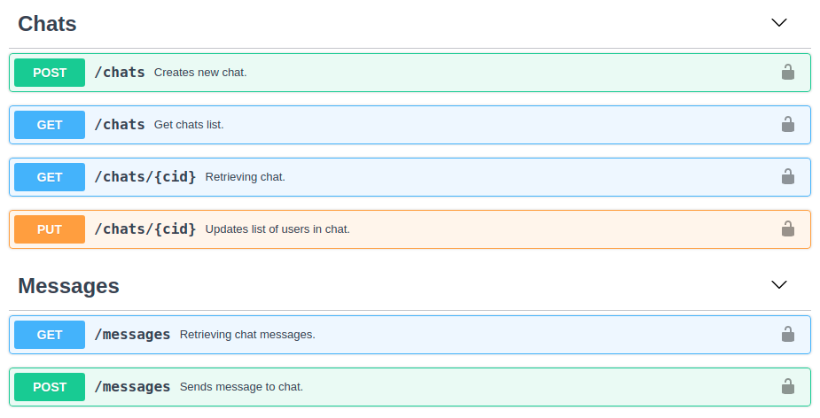

# Отчет по домашнему заданию "Разделение монолита на сервисы"

## Содержание

1. [ Задача ](#task)
2. [ Архитектура проекта ](#architecture)
3. [ Протокол взаимодействия ](#interaction-protocol)
    - [ REST API точки входа ](#entry-api)
    - [ REST API сервиса Диалогов ](#dialogue-api)
4. [ Тестирование ](#tests)
    - [ Подготовка окружения ](#env-prepearings)
    - [ Запросы к Dialogue Service ](#requests-to-dialogue)
5. [ Код сервисов ](#code)
6. [ Выводы ](#total)

<a name="task"></a>

## Задача

**Разделение монолита на сервисы**

- Вынести систему диалогов в отдельный сервис.
- Взаимодействия монолитного сервиса и сервиса чатов реализовать на Rest API или gRPC.
- Организовать сквозное логирование запросов.
- Предусмотреть то, что не все клиенты обновляют приложение быстро и кто-то может ходить через старое API.

Требования:

- Описан протокол взаимодействия.
- Поддержаны старые клиенты.
- Новые клиенты верно ходят через новый API.

<a name="architecture"></a>

## Архитектура проекта


### API Gateway

Доступная клиентам точка входа. На борту имеет HTTP интерфейс c REST API для запросов к внутренним сервисам, скрытым
внутри экосистемы. Так же служит для авторизации и реверсивного проксирования websocket соединений c сервисами новостей.

Авторизация внешних запросов происходит при помощи JWT токена, выпускаемого входной точкой при аутентификации клиента.

### MySQL

Cервер Базы Данных. Используется REST API сервисом, для хранения различных сущностей и их состояний.

В тестовом варианте состоит из master сервера и трех реплик.

С помощью orchestrator умеет выбирать нового мастера из выживших реплик.

Взаимодействие с MySQL происходит через ProxySQL, с распределением запросов на запись/чтение между master и репликами
соответственно.

### Dialogue Service

Сервис диалогов. Хранит чаты и связанные с ними сообщения пользователей.

На борту имеет REST API для запросов со стороны API Gateway.

Все запросы должны быть авторизированы от имени Entrypoint сервиса при помощи Bearer токена, который вшивается в
бинарный файл сервиса при сборке.

### Mongos + Mongo Shared Cluster

Mongos роутер для распределения запросов между шардами mongo кластера Подробнее c сервисом диалогов и mongo кластером
можно ознакомиться в [отчете по шардированию](../sharding/sharding.md)

### Kafka Events Bus

Очередь сообщений в лице Kafka + Zookeeper. Выполняет роль шины событий.

В данный момент продюсерлм сообщений выступает API Gateway Service. Потребителями инстансы News Service.

### News Service (Events Service)

Сервис для хранения/чтения пользовательских событий.

Подробнее о нем можно почитать в [отчете по очередям и кэшированию](../queues-n-cache/README.md)

По выполнению этого ДЗ, сервис сменил HTTP интерфейс на Websockets.

Прямой доступ извне к сервисам запрещен. Пользователя авторизует точка входа, после чего под API Gateway устанавливается
websocket соединение с выбранным инстансом News Service. Точка входа переключается в режим проксирования сообщений между
клиентом и сервисом новостей.

### Storekeeper

Сервис для обработки событий/новостей, полученных при чтении шины событий. Осуществляет сохранение событий в
персистентное хранилище, разогрев и актуализацию кэша.

### Redis

NoSQL DB, используется сервисом новостей, в качестве кэша, для быстрой выдачи списка новостей(событий) и быстрого
получения списка подписчиков.

### MongoDB

NoSQL база данных, используется сервисом новостей для персистентного хранения событий и подписчиков.

<a name="interaction-protocol"></a>

## Протокол взаимодействия

Все сервисы инкапсулированы в рамках внутренней сети. Взаимодействие между сервисами осуществляется через REST API,
открытое только для внутренних сервисов.

Авторизация запросов происходит через индивидуальные аутентификационные токены сервисов, которые вшиваются в бинарный
файл сервиса в процессе компиляции.

Между внешними клиентами и внутренними сервисами стоит API Gateway сервис, в задачи которого входит:

1. служить точкой входа для внешних запросов;
2. выполнять аутентификацию пользователей и авторизацию запросов;
3. предоставлять публичное REST API для запросов к экосистеме;
4. поддерживать версионность публичного API;
5. скрывать внутреннюю кухню и семантику взаимодействия от внешних пользователей.

<a name="entry-api"></a>

### REST API точки входа


> [Swagger документация для публичного REST API](../../docs/entrypoint.swagger.yaml)

> **Обращаю внимание**, что доступ к различным мажорным версиям публичного API "рулится" на уровне роутера. Первая версия доступна по пути `/v1`.
> В случае выпуска новой мажорной версии API, его интерфейс будет доступен по `/v2`.
> Таким образом API Gateway может одновременно поддерживать сколь угодно много мажорных версий API.

<a name="dialogue-api"></a>

### REST API сервиса Диалогов



> [Swagger документация для REST API сервиса диалогов](../../docs/dialogue.swagger.yaml)

<a name="tests"></a>

## Тестирование

<a name="env-prepearings"></a>

### Подготовка окружения

Стартуем окружение командой

> make upFull

Или через
> sudo docker-compose -f docker-compose.news.yml -f docker-compose.dialogue.yml -f docker-compose.standalone.yml -f docker-compose.queue.yml up --build -d

<a name="requests-to-dialogue"></a>

### Запросы к Dialogue Service

**1. Регистрируем пользователя `tester` и получаем JWT токен:**

> curl -XPOST http://127.0.0.1:8007/v1/auth/sign-up -d '{"username":"tester", "password":"1234567890", "passwordConfirm":"1234567890", "gender":"m"}'

```json
{
  "object": "token",
  "token": "JWT_OF_TESTER",
  "userId": 3,
  "username": "tester",
  "expires_at": 1615815772
}
```

**2. Регистрируем пользователя `tester2` и получаем JWT токен:**

> curl -XPOST http://127.0.0.1:8007/v1/auth/sign-up -d '{"username":"tester2", "password":"1234567890", "passwordConfirm":"1234567890", "gender":"m"}'

```json
{
  "object": "token",
  "token": "JWT_OF_TESTER2",
  "userId": 4,
  "username": "tester2",
  "expiresAt": 1615815776
}
```

**3. Создаем чат между `tester` и `tester2`:**

> curl -XPOST http://127.0.0.1:8007/v1/chats -d '{"users":[4,3]}' -H "Authorization:Bearer JWT_OF_TESTER"

```json
{
  "object": "chat",
  "id": "604f565622f02d3663a43d3b",
  "users": [
    3,
    4
  ],
  "createdAt": 1615812182
}
```

**4. Отсылаем сообщение от `tester` к `tester2`:**

> curl -XPOST http://127.0.0.1:8007/v1/chats/604f50945ace0bc016c02739/messages -d '{"txt":"Hello, tester2"}' -H "Authorization:Bearer JWT_OF_TESTER"

```json
{
  "object": "message",
  "id": "604f56cb22f02d3663a43d3c",
  "cid": "604f565622f02d3663a43d3b",
  "uid": 3,
  "createdAt": 1615812299,
  "text": "Hello, tester2"
}
```

**5. Отвечаем от `tester2` к `tester`:**

> curl -XPOST http://127.0.0.1:8007/v1/chats/604f50945ace0bc016c02739/messages -d '{"txt":"Hi, tester. How are you?"}' -H "Authorization:Bearer JWT_OF_TESTER2"

```json
{
  "object": "message",
  "id": "604f574022f02d3663a43d3d",
  "cid": "604f565622f02d3663a43d3b",
  "uid": 4,
  "createdAt": 1615812416,
  "text": "Hi, tester. How are you?"
}
```

**6. Считываем списки чатов:**

> curl http://127.0.0.1:8007/v1/chats -H "Authorization:Bearer JWT_of_tester"
> curl http://127.0.0.1:8007/v1/chats -H "Authorization:Bearer JWT_of_tester2"

В обоих случаях получаем ответ:

```json
{
  "object": "list",
  "data": [
    {
      "object": "chat",
      "id": "604f565622f02d3663a43d3b",
      "users": [
        3,
        4
      ],
      "created_at": 1615812182
    }
  ]
}
```

**7. Считываем списки сообщений под обоими пользователями:**

> curl http://127.0.0.1:8007/v1/chats/604f565622f02d3663a43d3b/messages -H "Authorization:Bearer JWT_OF_TESTER"
> curl http://127.0.0.1:8007/v1/chats/604f565622f02d3663a43d3b/messages -H "Authorization:Bearer JWT_OF_TESTER2"

В обоих случаях получаем ответ:

```json
{
  "object": "list",
  "data": [
    {
      "object": "message",
      "id": "604f574022f02d3663a43d3d",
      "cid": "604f565622f02d3663a43d3b",
      "uid": 4,
      "createdAt": 1615812416,
      "text": "Hi, tester. How are you?"
    },
    {
      "object": "message",
      "id": "604f56cb22f02d3663a43d3c",
      "cid": "604f565622f02d3663a43d3b",
      "uid": 3,
      "createdAt": 1615812299,
      "text": "Hello, tester2"
    }
  ]
}
```

**8. Проверим логи запросов на обоих сервисах**
> sudo docker logs backend

```
2021/03/15 12:43:02 [ddad7c64a23b/LGxTj7fF7r-000003] "POST http://127.0.0.1:8007/v1/chats HTTP/1.1" from 192.168.16.1:57988 - 200 88B in 27.69648ms
2021/03/15 12:44:34 [ddad7c64a23b/LGxTj7fF7r-000004] "POST http://127.0.0.1:8007/v1/chats/604f50945ace0bc016c02739/messages HTTP/1.1" from 192.168.16.1:59308 - 404 60B in 3.691525ms
2021/03/15 12:44:59 [ddad7c64a23b/LGxTj7fF7r-000005] "POST http://127.0.0.1:8007/v1/chats/604f50945ace0bc016c02739/messages HTTP/1.1" from 192.168.16.1:59666 - 200 150B in 9.29059ms
2021/03/15 12:45:23 [ddad7c64a23b/LGxTj7fF7r-000006] "GET http://127.0.0.1:8007/v1/chats HTTP/1.1" from 192.168.16.1:58292 - 200 115B in 2.676884ms
2021/03/15 12:45:26 [ddad7c64a23b/LGxTj7fF7r-000007] "GET http://127.0.0.1:8007/v1/chats HTTP/1.1" from 192.168.16.1:58292 - 200 115B in 5.176685ms
2021/03/15 12:45:53 [ddad7c64a23b/LGxTj7fF7r-000008] "GET http://127.0.0.1:8007/v1/chats/604f565622f02d3663a43d3b/messages HTTP/1.1" from 192.168.16.1:58724 - 200 28B in 2.900122ms
2021/03/15 12:45:58 [ddad7c64a23b/LGxTj7fF7r-000009] "GET http://127.0.0.1:8007/v1/chats/604f565622f02d3663a43d3b/messages HTTP/1.1" from 192.168.16.1:60252 - 200 177B in 8.890191ms
```

> sudo docker logs dialogue

```
2021/03/15 12:43:02 [ddad7c64a23b/LGxTj7fF7r-000003] "POST http://dialogue:8080/chats HTTP/1.1" from 192.168.16.6:38716 - 200 106B in 26.777376ms
2021/03/15 12:44:34 [ddad7c64a23b/LGxTj7fF7r-000004] "POST http://dialogue:8080/messages HTTP/1.1" from 192.168.16.6:38716 - 200 82B in 2.366559ms
2021/03/15 12:44:59 [ddad7c64a23b/LGxTj7fF7r-000005] "POST http://dialogue:8080/messages HTTP/1.1" from 192.168.16.6:38716 - 200 137B in 7.778223ms
2021/03/15 12:45:23 [ddad7c64a23b/LGxTj7fF7r-000006] "GET http://dialogue:8080/chats?uid=3&limit=100 HTTP/1.1" from 192.168.16.6:38716 - 200 121B in 1.836323ms
2021/03/15 12:45:26 [ddad7c64a23b/LGxTj7fF7r-000007] "GET http://dialogue:8080/chats?uid=4&limit=100 HTTP/1.1" from 192.168.16.6:38716 - 200 121B in 2.48648ms
2021/03/15 12:45:53 [ddad7c64a23b/LGxTj7fF7r-000008] "GET http://dialogue:8080/messages?uid=3&cid=604f565622f02d3663a43d3b&limit=100 HTTP/1.1" from 192.168.16.6:38716 - 200 52B in 2.442122ms
2021/03/15 12:45:58 [ddad7c64a23b/LGxTj7fF7r-000009] "GET http://dialogue:8080/messages?uid=4&cid=604f565622f02d3663a43d3b&limit=100 HTTP/1.1" from 192.168.16.6:38716 - 200 153B in 6.170709ms
```

> **Обращаю внимание**, что в логах обоих сервисов присутствует уникальный идентификатор запроса.
> Идентификатор выпускается для любого внешнего запроса, и передается между обрабатывающими его сервисами через http заголовок `X-Request-Id`.
> Ответы от API Gateway так же снабжены http заголовком c идентификатором запроса, что позволяет быстро определить всю историю движений запроса внутри системы.

<a name="code"></a>

## Код сервисов

- [API Gateway](../../backend)
- [Сервис Диалогов](../../dialogue)
- [Сервис Новостей](../../news)
- [AngularJs Web клиент](../../frontend/src)

<a name="total"></a>

## Выводы

Проект поддерживает версионирование публичного API, позволяя одновременно держать доступными несколько мажорных версий.

Ядро проекта базово декомпозировано под требования задачи. Функционал диалогов и новостей вынесен в отдельные внутренние
сервисы.

Входящий запрос маркируется точкой входа при помощи уникального идентификатора запроса, который доступен всем внутренним
сервисам осуществляющим обработку запроса. Идентификатор запроса участвует в логгировании, как сквозной идентификатор,
что позволяет быстро восстановить всю историю движения запроса внутри экосистемы.

При проведении дальнейшей декомпозиции, имеет смысл вынести функционал авторизации и выпуска jwt токенов также в
отдельный сервис.

Для запросов внутри экосистемы стоит отказаться от REST в пользу gRPC, как более эффективного и экономичного способа
меж-сервисного общения.
