# Отчет по домашнему заданию "Мониторинг"

## Содержание

1. [ Задача ](#task)
2. [ Подготовка окружения ](#preparation)
   - [ Докеризация ](#dockerize-it)
   - [ Конфигурация Zabbix ](#zabbix-config)
   - [ Конфигурация Prometheus ](#prometheus-config)
   - [ Конфигурация Grafana ](#grafana-config)
3. [ Запуск и проверка мониторинга ](#testing)
   - [ Zabbix ](#zabbix)
   - [ Prometheus + Grafana ](#prometheus-grafana)
      - [ RED метрики ](#grafana-red-metrics)
      - [ Технические метрики приложения ](#grafana-tech-metrics)
4. [ Итого ](#total)

## Задача

Необходимо:

- [x] [развернуть zabbix](#zabbix-config);
- [x] [развернуть prometheus](#prometheus-config);
- [x] [развернуть grafana](#grafana-config);
- [x] [начать писать в prometheus бизнес-метрики сервиса чатов по принципу RED](#grafana-red-metrics);
- [x] [начать писать в zabbix технические метрики сервера с сервисом чатов](#zabbix);
- [x] [организовать дашборд в grafana](#prometheus-grafana).

Требования:

- Сбор технических метрик осуществляется верно;
- Сбор бизнес метрик осуществляется верно по принципу RED;
- В grafana организован дашборд.

## Подготовка окружения

### Докеризация

Deployment конфигурация окружения для всего мониторинга расположена
в [docker-compose.monitoring.yml](../../docker-compose.monitoring.yml)

Внутри описаны следующие сервисы:

1. zabbix-server, официальный образ zabbix/zabbix-server-pgsql:alpine-latest, zabbix-сервер для работы с техническими
   метриками;
2. postgres, официальный образ postgres:13.2-alpine, база данных для хранения zabbix метрик;
3. zabbix-web, официальный образ zabbix/zabbix-web-nginx-pgsql:alpine-latest, web интерфейс для управления zabbix;
4. prometheus, официальный образ prom/prometheus, prometheus сервер для сбора бизнес-метрик с сервисов;
5. grafana, официальный образ grafana/grafana, сервис для визуализации бизнес-метрик из prometheus.

### Конфигурация Zabbix

Какой либо дополнительной конфигурации не требуется. Метрики создаются в ручную, через web-интерфейс. Сами метрики
отсылаются напрямую из узлов сервиса диалогов.

[Реализация сбора и отправки метрик в коде](../../dialogue/zabbix/observer.go)

### Конфигурация Prometheus

[Файл конфигурации для Dialogue сервиса](../../deployment/prometheus/prometheus.yml)

В файле так же настраиваются воркеры для сбора метрик с двух узлов сервиса диалогов.

Метрики будут собираться посредством http запросов на роут `/metrics` каждого из узлов dialogue сервиса.

- [Реализация Middleware для сбора](../../dialogue/server/middleware.go#43)
- [Подключение Middleware](../../dialogue/server/server.go#38)
- [Реализация выдачи метрик по запросу](../../dialogue/server/server.go#69)

### Конфигурация Grafana

- [Файл конфигурации](../../deployment/grafana/config.ini)
- [Настройка Dashboard c метриками](../../deployment/grafana/dashboards/grafana-prometeus-metrics.json)
- [Настройка ресурсов для Dashboard](../../deployment/grafana/provisioning)

## Запуск и проверка мониторинга

Запускаем командами:
> make upWithMonitoring

или

> sudo docker-compose -f docker-compose.dialogue.yml -f docker-compose.monitoring.yml -f docker-compose.standalone.yml -f docker-compose.queue.yml up --build -d

Останавливаем командами:
> make downWithMonitoring

или

> sudo docker-compose -f docker-compose.dialogue.yml -f docker-compose.monitoring.yml -f docker-compose.standalone.yml -f docker-compose.queue.yml down -v

### Zabbix

После запуска zabbix, web интерфейс будет доступен по адресу http://127.0.0.1:8081

Дефолтные логин и пароль: **Admin/zabbix**

Прежде всего создаем метрики:

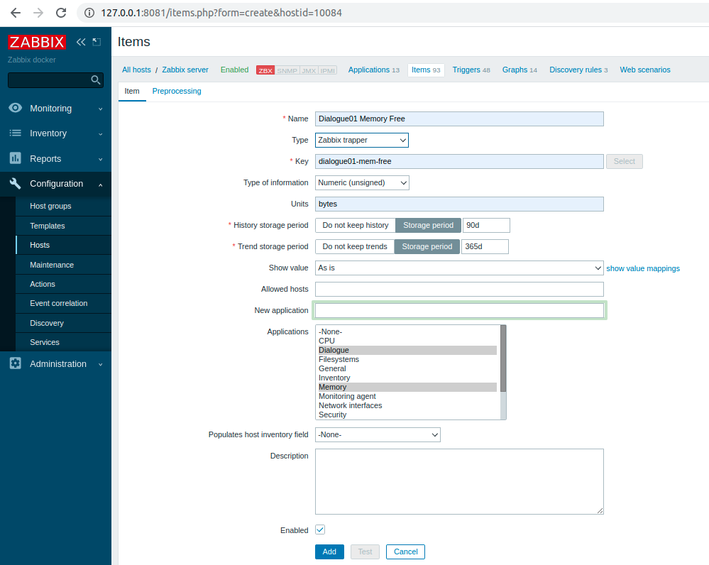

Всего узлами сервиса диалогов поставляется 6 видов метрик:

1. CPU Idle, простой процессорных мощностей, в процентах;
2. CPU System, нагрузка на процессоры со стороны системы, в процентах;
3. CPU Used, нагрузка на процессоры со стороны узла сервиса диалогов, в процентах;
4. Memory Used, количество занятой памяти, в байтах;
5. Memory Free, количество свободной памяти, в байтах;
6. Memory Cached, количество зарезервированной память, в байтах.

Добавляем метрики для каждого из двух узлов. Должна получиться следующая картина:

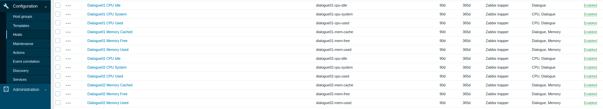

Направляемся в раздел Monitoring -> Latest Data, проверяем наличие метрик и данных по ним:

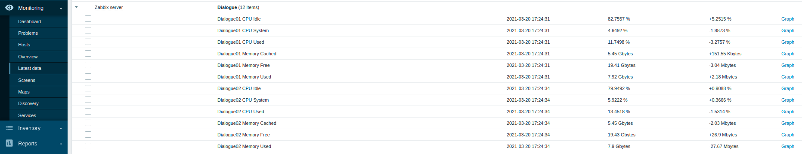

> **Обращаем внимание**, что судя цифрам метрик, данные с сервисов поступают.

Проверяем графики метрик. Я приведу только два графика, дабы не перегружать отчет:

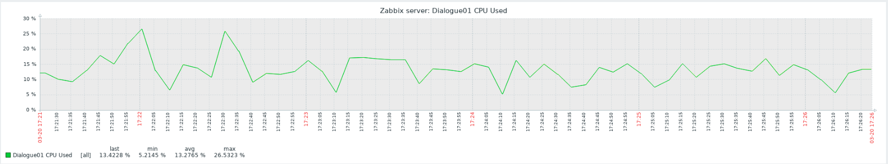

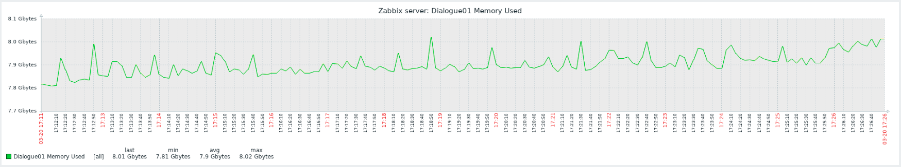

### Prometheus + Grafana

После старта Grafana будет доступна по адресу http://127.0.0.1:3000

Дефолтные логин и пароль: **admin/admin**

При входе должен быть доступен дашбоард "GO SERVICE METRICS". Данная борда будет иметь следующий состав элементов:

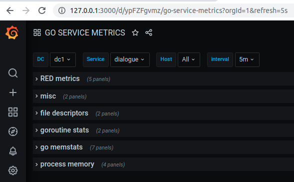

В составе бизнес метрики RED + технические метрики, в том числе специфичные для парадигмы golang.

#### RED метрики

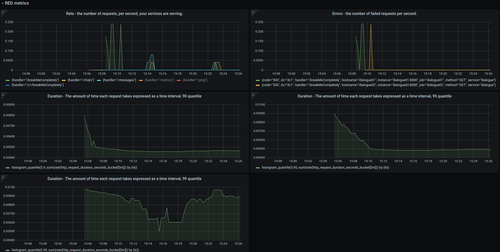

**Rate** - количество запросов в единицу времени.

**Errors** - количество запросов с non-20x статусом ответа в единицу времени. Для имитации ошибок использовался спец
Fail-Route, всегда отдающий 500-ый ответ.

Fail-Route доступен по адресам:

- dialogue node01 http://127.0.0.1:8009/breakMeCompletely
- dialogue node02 http://127.0.0.1:8010/breakMeCompletely

**Duration** - количество времени затраченное на обработку каждого из запросов за определенный интервал времени.
Представлены графики для 90, 95 и 99 квантилей.

#### Технические метрики приложения

**Сборщик мусора**

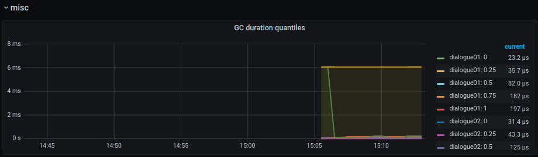

**Файловые дескрипторы**

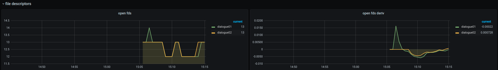

**Количество го-рутин и активных тред**

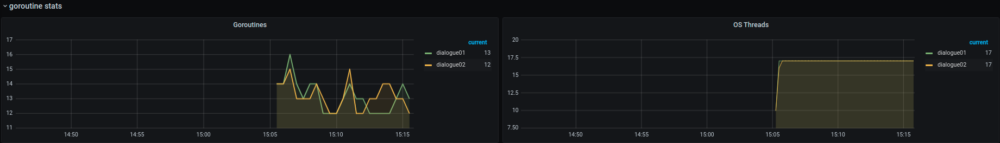

**Расход памяти**

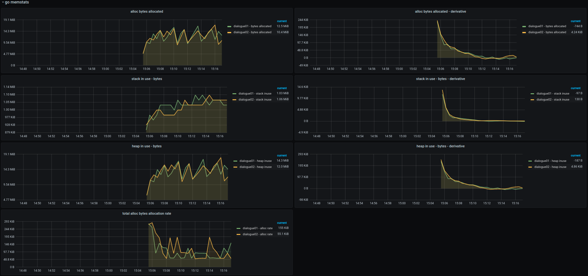

**Resident & Virtual memory**

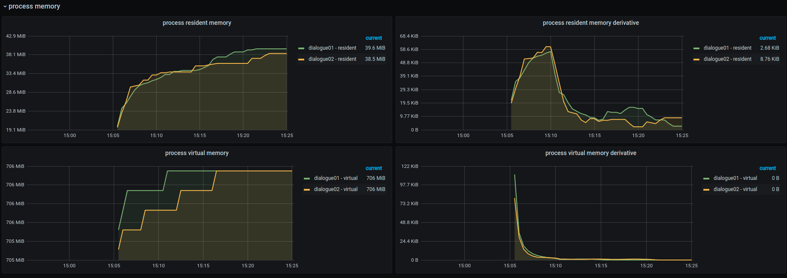

## Итого

- Zabbix развернут;
- Prometheus развернут;
- Grafana тоже развернут;
- Бизнес метрики по принципу RED пишутся в prometheus + бонусом использованный opensource пакет отдает еще и технические
  метрики;
- Технические метрики пишутся в zabbix и доступны из web-интерфейса;
- Дашборд в grafana организован.
