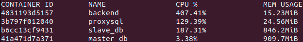
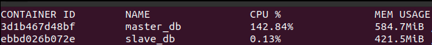

# Отчет по R/W split репликации
## Содержание
1. [ Задача ](#task)
2. [ Инструментарий ](#instruments)
3. [ Настройка окружения ](#setup-env)
    - [ Конфигурация ](#configuration)
    - [ Что под капотом ](#what_is_inside)
    - [ Настройка MySQL ](#mysql_settings)
    - [ Настройка реплики ](#replica-settings)
        - [ Master Host ](#repl-master-host)
        - [ Slave Host ](#repl-slave-host)
        - [ Сервисные пользователи ](#repl-service-users)
    - [ Настройка ProxySQL ](#proxysql-settings)
4. [ Запуск окружения ](#startup)
    - [ Состояние реплики ](#check-replica-state)
    - [ Состояние ProxySQL ](#check-proxysql-state)
5. [ Нагрузочные тесты ](#vantage-tests)
    - [ Результаты с R/W распределением запросов ](#results-with-rw-split)
        - [ Нагрузка на запись ](#vantage-read)
        - [ Нагрузка на чтение ](#vantage-write)
        - [ Статистика ProxySQL ](#vantage-proxysql-stats)
    - [ Результаты без R/W распределения запросов ](#results-without-rw-split)
6. [ Выводы ](#in-total)

<a name="task"></a>
## Задача
1) Настроить асинхронную репликацию;
2) Выбрать 2 любых запроса на чтение (в идеале самых частых и тяжелых по логике работы сайта) и перености их на чтение со слейва;
3) Сделать нагрузочный тест по странице, которую перевели на слейв до и после репликации. Замеряем нагрузку мастера (CPU, la, disc usage, memory usage).

<a name="instruments"></a>
## Инструментарий
- **ProxySQL v2.1.0** для read/write разделения запросов между master и slave нодами
- **MySQL version 8.0.22**
- **Docker-compose** для оркестрации окружения
- **Утилита wrk** для нагрузочного тестирования

<a name="setup-env"></a>
## Настройка окружения

<a name="configuration"></a>
### Конфигурация
1. [Конфиг docker-compose](../../docker-compose.proxysql.yml)
2. [Конфиг Master Node](../../deployment/replica/mysql/master.cnf)
3. [Конфиг Slave Node](../../deployment/replica/mysql/slave.cnf)
4. [Конфиг ProxySQL](../../deployment/proxysql/proxysql.cnf)
5. [Cкрипт конфигурирования реплики](../../deployment/replica/setupReplica.sh)

<a name="what_is_inside"></a>
### Что под капотом

docker-compose запускает окружение, сконфигурированное при помощи вышеупомянутых конфигурационных файлов.

Далее стартует `firestarter` сервис. Его задачи
- создать в БД набор сервисных пользователей;
- сконфигурировать репликацию;
- добавить пользователей и сервера баз данных в ProxySql.

<a name="mysql_settings"></a>
### Настройка MySQL
Master my.cnf
```
server-id=1
report_host=master_db
read_only=0
...
```

Slave my.cnf
```
server-id=2
report_host=slave1_db
read_only=1
...
```

`read_only` флаг заранее задаст правила чтения и записи. Так же ProxySql использует этот атрибут для привязки сервера в рантайме к определенной хостгруппе.

<a name="replica-settings"></a>
### Настройка реплики

<a name="repl-master-host"></a>
#### Master Host
Создаем пользователя репликации, под которым Slave Host будет читать обновления:
```SQL
CREATE USER '$REPL_USER'@'%' IDENTIFIED BY '$REPL_PASSWORD';
GRANT REPLICATION SLAVE ON *.* TO '$REPL_USER'@'%';
```

<a name="repl-slave-host"></a>
#### Slave Host
Указываем для Slave, кто здесь Master, и запускаем репликацию:
```SQL
  CHANGE MASTER TO MASTER_HOST='master_db',MASTER_USER='$REPL_USER',MASTER_PASSWORD='$REPL_PASSWORD';
  START SLAVE;
```

<a name="repl-service-users"></a>
#### Сервисные пользователи

> Набор сервисных пользователей должен быть создан на Master и Slave хостах

Создаем пользователя для мониторинга состояния (требуется для ProxySql):
```SQL
CREATE USER '$MONITOR_USER'@'%' IDENTIFIED BY '$MONITOR_PASSWORD';
GRANT REPLICATION CLIENT ON *.* TO '$MONITOR_USER'@'%';
```

Создаем пользователя, под которым ProxySql будет проксировать запросы на target хосты:
```SQL
CREATE USER '$PROXY_USER'@'%' IDENTIFIED BY '$PROXY_PASSWORD';
GRANT INSERT, SELECT, UPDATE, DELETE, LOCK TABLES, EXECUTE, CREATE, ALTER, INDEX, REFERENCES ON otus_ha.* TO '$PROXY_USER'@'%';
```

В конце сбрасываем привилегии `FLUSH PRIVILEGES;`

<a name="proxysql-settings"></a>
### Настройка ProxySQL
Ниже указаны участки из [конфига ProxySql](../../deployment/proxysql/proxysql.cnf), на которые стоит обратить внимание.

**Определяем хостгруппы чтения и записи:**

Все запросы на чтение будут направлены в `reader_hostgroup=2`, на запись в `writer_hostgroup=1` 
```
...
mysql_replication_hostgroups =
(
    { writer_hostgroup=1, reader_hostgroup=2, comment="host groups" }
)
...
```

**Определяем правила роутинга запросов.**

Запрос будет перенаправлен на сервер хостгруппы соответствующей "стрельнувшему" правилу.

> Если ни одно правило не "стреляет", то запрос уйдет в дефолтную хостгруппу, в моем случае это `writer_hostgroup=1`.
Дефолтная хостгруппа задается при создании прокси пользователя. 

Набор правил:
```
    {
        rule_id=1
        active=1
        match_pattern="^SELECT.*FOR UPDATE"
        destination_hostgroup=1
        apply=1
    },
    {
        rule_id=2
        active=1
        match_pattern="^SELECT.*"
        destination_hostgroup=2
        apply=1
    }
```

Правила применяются в порядке следования `rule_id`.

Аттрибут `apply=1` прерывает цепочку проверки правил, если содержащему его правилу удовлетворяет пришедший запрос.

Если аттрибуту `apply` задать значение 0, то проверка правил пойдет дальше, таким образом можно будет перенаправить запрос на несколько хостов.

Аттрибут `destination_hostgroup` укажет, в какую хостгруппу отправить запрос на исполнение.

Из правил становится понятно, что все запросы на запись, включая запрос на чтение с блокировкой для записи, уйдут в `writer_hostgoup=1`

Все остальные SELECT запросы будут перенаправлены на серверы в `reader_hostgroup=2`

**Создаем пользователей**
Пользователей и хосты можно задать как через конфигурационный файл, так и через прямой запрос к админскому интерфейсу ProxySQL.

Т.к. параметры пользователей и хостов в моем решении задаются на основе файла с переменными окружения `.env`, мне было удобнее провести инициализацию через прямые запросы.

Меняем мониторинг-пользователя, на созданного при конфигурировании MySQL нод:
```SQL
UPDATE global_variables SET variable_value='${MONITOR_USER}' WHERE variable_name='mysql-monitor_username';
UPDATE global_variables SET variable_value='${MONITOR_PASSWORD}' WHERE variable_name='mysql-monitor_password';
LOAD MYSQL VARIABLES TO RUNTIME;
SAVE MYSQL VARIABLES TO DISK;
```
> ProxySQL будет использовать этого пользователя для чтения состояния ввереных под его управление хостов.

Создаем пользователя, под которым будут проксироваться запросы на таргет хосты:
```SQL
INSERT INTO mysql_users (username,password,active,default_hostgroup) values ('$PROXY_USER','$PROXY_PASSWORD',1,1);
LOAD MYSQL USERS TO RUNTIME;
SAVE MYSQL USERS TO DISK;
```
> Обратите внимание, что в качестве `default_hostgroup` указана хостгруппа записи. По дефолту туда пойдут все запросы.  

**Задаем MySQL серверы**
```SQL
INSERT INTO mysql_servers (hostgroup_id,hostname,port,max_replication_lag) VALUES (1,'master_db',3306,1), (2,'slave_db',3306,1);
LOAD MYSQL SERVERS TO RUNTIME;
SAVE MYSQL SERVERS TO DISK;
```
Master Host определен в хостгруппу записи, Slave Host в группу чтения.

<a name="startup"></a>
## Запуск окружения
Выполняем команду
> make up TYPE=replica

<a name="check-replica-state"></a>
### Состояние реплики
В логах `firestarter` находим отчет о начальном состоянии реплики.
> sudo docker logs replicator

**Master status:**
```
File: master_db-bin.000003
Position: 2213
Binlog_Do_DB: 
Binlog_Ignore_DB: 
Executed_Gtid_Set: 
```

**Slave status:**
```
Slave_IO_State: Waiting for master to send event
Master_Host: master_db
Master_Port: 3306
Master_Log_File: master_db-bin.000003
Read_Master_Log_Pos: 3087
Relay_Log_File: slave_db-relay-bin.000004
Relay_Log_Pos: 2436
Relay_Master_Log_File: master_db-bin.000003
Slave_IO_Running: Yes
Slave_SQL_Running: Yes
Replicate_Do_DB: otus_ha
Exec_Master_Log_Pos: 2213
Relay_Log_Space: 3122377
Master_Server_Id: 1
Master_UUID: caffd9b5-5e55-11eb-bdd6-0242ac1e0002
```

Реплика успешно запустилась и успела считать миграции, прошедшие на мастер хосте.

<a name="check-proxysql-state"></a>
### Состояние ProxySQL
Соединяемся с ProxySQL через админский интерфейс
> mysql --host="127.0.0.1" -P16032 --user="${PROXY_ADMIN}" --password="${PROXY_ADMIN_PASSWORD}"

**Проверяем хостгруппы:**
```
select * from mysql_replication_hostgroups;
+------------------+------------------+------------+-------------+
| writer_hostgroup | reader_hostgroup | check_type | comment     |
+------------------+------------------+------------+-------------+
| 1                | 2                | read_only  | host groups |
+------------------+------------------+------------+-------------+
```
Хостгруппы распределены корректно.

**Проверяем сервера БД:**
```
select hostgroup_id, hostname, port, status from mysql_servers;
+--------------+-----------+------+--------+
| hostgroup_id | hostname  | port | status |
+--------------+-----------+------+--------+
| 1            | master_db | 3306 | ONLINE |
| 2            | slave_db  | 3306 | ONLINE |
+--------------+-----------+------+--------+
```
Master хост закреплен за группой записи, Slave хост за группой чтения. Оба сервера, в данный момент, доступны.

**Проверяем правила маршуртизации**
```
select rule_id, active, match_digest from mysql_query_rules;
+---------+--------+------------------------+
| rule_id | active | match_digest           |
+---------+--------+------------------------+
| 1       | 1      | ^SELECT .* FOR UPDATE$ |
| 2       | 1      | ^SELECT.*              |
+---------+--------+------------------------+
```

ProxySQL успешно взлетел и готов к бою.

<a name="vantage-tests"></a>
## Нагрузочные тесты

Тесты проводились при помощи утилиты `wrk`.

Пример запуска теста:
> wrk -t10 -c10 -d10m --timeout 30s -H "Authorization: Bearer: <Auth_Token>" -s ./request.lua http://127.0.0.1:8007

Текст lua скрипта можно найти в [предыдущем отчете](../indexes/report.md)

<a name="results-with-rw-split"></a>
### Результаты с R/W распределением запросов

<a name="vantage-read"></a>
#### Нагрузка на запись
Инициируем наполнение базы 1М записей

> ./seeder -dbHost "127.0.0.1:16033" -u "${PROXY_USER}" -p "${PROXY_PASSWORD}" -q 1000000

Наблюдаем за нагрузкой:
> sudo docker stats master_db slave_db

Как можно увидеть запись идет непосредственно на Master хост, Slave затронут только из за идущей репликации данных:


<a name="vantage-write"></a>
#### Нагрузка на чтение
Основная нагрузка идет на Slave хост. Нагрузка на Master Host, скорее всего, обусловлена хелзчеками



<a name="vantage-proxysql-stats"></a>
#### Статистика ProxySQL
Подключаемся к интерфейсу статистики ProxySQL.
> Подключение возможно только с локального хоста. Базовый контейнер ProxySQL не имеет на борту mysql-client, об этом стоит позаботиться заранее.

> mysql --host="127.0.0.1" -P6032 "--user=stat --password=stats

Статистика срабатывания правил роутинга
```
select * from stats_mysql_query_rules;
+---------+--------+
| rule_id | hits   |
+---------+--------+
| 2       | 970367 |
+---------+--------+
```
2 - хостгруппа чтения

Статистика распределения запросов по серверам:
```
SELECT hostgroup, srv_host, Queries, Bytes_data_sent FROM stats_mysql_connection_pool;
+-----------+-----------+---------+-----------------+
| hostgroup | srv_host  | Queries | Bytes_data_sent |
+-----------+-----------+---------+-----------------+
| 1         | master_db | 2025    | 121756001       |
| 2         | slave_db  | 970367  | 10154551        |
+-----------+-----------+---------+-----------------+
```
2025 запросов на Мастер хост - это запросы из первичной миграции + запросы на вставку 1М записей.
970367 запросов на Slave хост, число совпадает с количеством срабатывания правила на чтение.

Статистика по запросам:
```
SELECT hostgroup, sum_time, count_star, SUBSTR(digest_text, 0, 110) FROM stats_mysql_query_digest ORDER BY hostgroup DESC, last_seen DESC;
+-----------+-----------+------------+---------------------------------------------------------------------------------------------------------------+
| hostgroup | sum_time  | count_star | SUBSTR(digest_text, 0, 110)                                                                                   |
+-----------+-----------+------------+---------------------------------------------------------------------------------------------------------------+
| 2         | 502595198 | 970365     | select u.id,u.username,u.first_name,u.last_name,u.age,u.gender,u.city,u.password_hash,u.created_at,u.interest |
| 2         | 1722      | 1          | select now()                                                                                                  |
| 2         | 68054     | 1          | select * from `gorp_migrations`                                                                               |
| 1         | 81907410  | 2016       | insert into `users` (`username`,`first_name`,`last_name`,`gender`,`password_hash`) values (?,?,?,?,?),(?,?,?, |
| 1         | 0         | 1          | commit                                                                                                        |
| 1         | 5161      | 2          | insert into `gorp_migrations` (`id`,`applied_at`) values (?,?);                                               |
| 1         | 74194     | 1          | create table `users` ( `id` int(?) unsigned not null auto_increment,`username` varchar(?) not null,`first_nam |
| 1         | 69280     | 1          | create table `friends` ( `user_id` int(?) not null,`friend_id` int(?) not null,`created_at` timestamp not nul |
| 1         | 53066     | 1          | alter table users add unique index un_idx (username)                                                          |
| 1         | 626       | 1          | insert into `users` values (?, ?, ?, ?,?, ?, ?, ?,Now(), ?),(?, ?, ?, ?,?, ?, ?, ?,Now(), ?)                  |
| 1         | 63102     | 1          | create table if not exists `gorp_migrations` (`id` varchar(?) not null primary key,`applied_at` datetime) eng |
| 1         | 388       | 1          | start transaction                                                                                             |
+-----------+-----------+------------+---------------------------------------------------------------------------------------------------------------+
```

Как видим, распределение операций чтения и записи успешно отрабатывает.

<a name="results-without-rw-split"></a>
### Результаты без R/W распределения запросов

Т.к. реплика базово настроена на разделение запросов на чтение и запись между мастером и слейвом, то до начала тестов необходимо отключить правила роутинга в ProxySQL.
```sql
UPDATE mysql_query_rules SET active=0;
LOAD MYSQL QUERY RULES TO RUNTIME;
SAVE MYSQL QUERY RULES TO DISK;
```

Запускаем тест и смотрим нагрузку:



Как можно увидеть, основная нагрузка идет на мастер хост.

>  На тестах база была воссоздана с нулевой точки, заполнена 1М записей, при этом не имела индексов. Именно с этим связана высокая утилизация по CPU и памяти.

<a name="in-total"></a>
### Выводы
При помощи распределения операций чтения между Slave узлами можно существенно разгрузить Master ноду, что потенциально увеличит пропускную способность сервиса, как на операциях записи, так и на операциях чтения.

Что касается дополнительного интструментария для роутинга запросов, то он, разумеется, несет дополнительные накладные расходы на ресурсы и запросы во внутренней сети, но дает существенно больше гибкости при возможном горизонтальном массштабировании. Не стоит так же забывать и про обширный инструментарий, идущий с ним из коробки. Что касается выкриков из аудитории про "единную точку отказа", тот же ProxySQL умеет в кластер.

Если накладные расходы на прокси сервис все же играют роль, или горизонтальное массштабированиеи сервиса и БД не планируются, то стоит рассмотреть вариант роутинга запросов на уровне приложения.