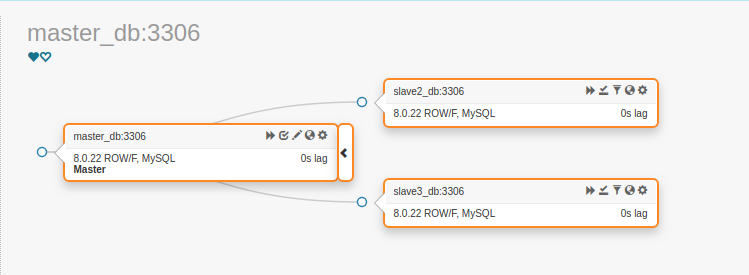
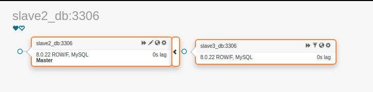

# Отчет по Semi-Sync репликации в MySQL

## Содержание
1. [ Задача ](#task)
2. [ Инструментарий ](#instruments)
3. [ Настройка окружения ](#setup-env)
   - [ Конфигурация ](#configuration)
   - [ Настройка MySQL ](#mysql_settings)
   - [ Настройка Semi-Sync реплики ](#semi-sync-settings)
      - [ Master Host ](#repl-master-host)
      - [ Сервисные пользователи ](#repl-service-users)
      - [ Slave Hosts ](#repl-slave-hosts)
   - [ Настройка ProxySQL ](#proxysql-settings)
   - [ Настройка Orchestrator ](#orchestrator-settings)
4. [ Запуск окружения ](#startup)
   - [ Состояние реплики ](#check-replica-state)
      - [ Состояние Master узла ](#master-state)
      - [ Состояние Slave узла ](#slave-state)
   - [ Состояние ProxySQL ](#check-proxysql-state)
   - [ Состояние топологии ](#check-topology)
5. [ Failover Тест ](#failover-test)
   - [ Состояние топологии ](#failover-topology-state)
   - [ Состояние ProxySQL ](#failover-proxysql-state)
   - [ Состояние нового Master хоста ](#failover-new-master)
   - [ Состояние узла Slave #3 ](#failover-slave3-state)
   - [ Состояние данных ](#failover-data-state)
6. [ Выводы ](#in-total)
7. [ Боль ](#my-pain)

<a name="task"></a>
## Задача
1) Настроить 2 слейва и 1 мастер.
2) Включить row-based репликацию.
3) Включить GTID.
4) Настроить полусинхронную репликацию.
6) Создать нагрузку на запись в любую тестовую таблицу. На стороне, которой нагружаем считать, сколько строк мы успешно записали.
7) Убиваем мастер MySQL, заканчиваем нагрузку на запись.
9) Выбираем самый свежий слейв. Промоутим его до мастера. Переключаем на него второй слейв.
10) Проверяем, есть ли потери транзакций.


<a name="instruments"></a>
## Инструментарий
- **ProxySQL v2.1.0** роутинг запросов между master и slave нодами + наглядная стата цифрах
- **MySQL version 8.0.22**
- **Docker-compose** для стартап оркестрации окружения
- **Orchestrator 3.2.3** для оркестрации кластера из одного master и трех slave реплик. Он у нас будет отвечать за промоутинг нового master-a, после падения первого.

<a name="setup-env"></a>
## Настройка окружения

<a name="configuration"></a>
### Конфигурация
1. [Конфиг docker-compose](../../docker-compose.orchestrator.yml)
2. Конфигурация MySQL серверов
    - [Конфиг Master Node](../../deployment/cluster/mysql/master.cnf)
    - [Конфиг Slave Node #1](../../deployment/cluster/mysql/slave1.cnf)
    - [Конфиг Slave Node #2](../../deployment/cluster/mysql/slave2.cnf)
    - [Конфиг Slave Node #3](../../deployment/cluster/mysql/slave3.cnf)
3. [Конфиг ProxySQL](../../deployment/proxysql/proxysql.cnf)
4. [Конфиг Orchestrator](../../deployment/orchestrator/orc.conf.json)
5. [Cкрипт конфигурирования реплики](../../deployment/cluster/setupCluster.sh)

<a name="mysql_settings"></a>
### Настройка MySQL
Master my.cnf
```
server-id=1
report_host=master_db
read_only=0
...
# Включаем ROW Based Replication
binlog_format=ROW

# Включаем GTID
gtid_mode=ON
enforce_gtid_consistency=ON
...
```

Slave `N` my.cnf
```
server-id=<N>
report_host=slave<N>_db
read_only=1
...
# Включаем ROW Based Replication
binlog_format=ROW

# Включаем GTID
gtid_mode=ON
enforce_gtid_consistency=ON
...
```

`read_only` флаг заранее задаст правила чтения и записи. Так же ProxySql использует этот атрибут для привязки сервера в рантайме к определенной хостгруппе.

<a name="semi-sync-settings"></a>
### Настройка Semi-Sync реплики

<a name="repl-master-host"></a>
#### Master Host
Устанавливаем и настраиваем плагин полусинхронной репликации
```SQL
INSTALL PLUGIN rpl_semi_sync_master SONAME 'semisync_master.so';
SET GLOBAL rpl_semi_sync_master_enabled=1;
SET GLOBAL rpl_semi_sync_master_wait_for_slave_count=3;
SET GLOBAL rpl_semi_sync_master_timeout=5000;
```

> Указанное значение rpl_semi_sync_master_wait_for_slave_count не самый лучший вариант, в плане производительности, но для тестов мне нужна уверенность, что все данные доедут до всех реплик.

<a name="repl-service-users"></a>
#### Сервисные пользователи

> Набор сервисных пользователей должен быть создан на Master и Slave хостах

На всех хостах создаем пользователя реплики.
> Создаем на всех, потому что при падении Master узла, кластер будет перестроен, и Slave узлы будут вынуждены реплицироваться с нового Master узла. 
```sql
CREATE USER '$REPL_USER'@'%' IDENTIFIED BY '$REPL_PASSWORD';
GRANT REPLICATION SLAVE ON *.* TO '$REPL_USER'@'%';
```

Создаем пользователей для ProxySql (мониторинг и роутинг):
```SQL
CREATE USER '$MONITOR_USER'@'%' IDENTIFIED BY '$MONITOR_PASSWORD';
GRANT REPLICATION CLIENT ON *.* TO '$MONITOR_USER'@'%';

CREATE USER '$PROXY_USER'@'%' IDENTIFIED BY '$PROXY_PASSWORD';
GRANT INSERT, SELECT, UPDATE, DELETE, LOCK TABLES, EXECUTE, CREATE, ALTER, INDEX, REFERENCES ON otus_ha.* TO '$PROXY_USER'@'%';
```

Создаем пользователя оркестрации. Под ним оркестратор будет мониторить и перестраивать топологию:
```sql
CREATE USER '${ORC_USER}'@'%' IDENTIFIED BY '$ORC_PASSWORD';
GRANT SUPER, PROCESS, REPLICATION SLAVE, RELOAD ON *.* TO '${ORC_USER}'@'%';
GRANT SELECT ON mysql.slave_master_info TO '${ORC_USER}'@'%';
```

В конце сбрасываем привилегии `FLUSH PRIVILEGES;`

<a name="repl-slave-hosts"></a>
#### Slave Hosts

> Выполняется на всех Slave хостах

Инициализируем реплику
```sql
CHANGE MASTER TO MASTER_HOST='master_db',
    MASTER_USER='$REPL_USER',
    MASTER_PASSWORD='$REPL_PASSWORD',
    MASTER_AUTO_POSITION=1;
START SLAVE;
```

Устанавливаем и настраиваем плагин полусинхронной репликации
```SQL
INSTALL PLUGIN rpl_semi_sync_slave SONAME 'semisync_slave.so';
SET GLOBAL rpl_semi_sync_slave_enabled=1;
STOP SLAVE IO_THREAD;
START SLAVE IO_THREAD;
```

<a name="proxysql-settings"></a>
### Настройка ProxySQL
ProxySQL [настраивается аналогично](p1_replica_rw_split.md#proxysql-settings), за тем лишь исключением, что теперь надо добавить три Slave узла с хостгруппой чтения.

<a name="orchestrator-settings"></a>
### Настройка Orchestrator
Из важного в [конфиге оркестратора](../../deployment/orchestrator/orc.conf.json):
- **MySQLTopologyUser** - username ранее созданного в Master/Slave узлах пользователя оркестрации
- **MySQLTopologyPassword** - password пользователя оркестрации
- **ApplyMySQLPromotionAfterMasterFailover** = true - разрешаем перестроение кластера при падении Master хоста

<a name="startup"></a>
## Запуск окружения
Выполняем команду
> make up TYPE=cluster

Подключаем кластер в оркестрацию
> sudo docker exec orc bash discoverCluster.sh

<a name="check-replica-state"></a>
### Состояние реплики
В логах `firestarter` находим отчет о начальном состоянии реплики.
> sudo docker logs replicator

<a name="master-state"></a>
#### Состояние Master узла
**Master status:**
```
File: mysql-bin.000003
Position: 2685
Binlog_Do_DB:
Binlog_Ignore_DB:
Executed_Gtid_Set: 90261e09-5fba-11eb-9b6f-0242c0a83002:1-16
```

**Global variables:**
```
+-------------------------------------------+------------+
| Variable_name                             | Value      |
+-------------------------------------------+------------+
| rpl_semi_sync_master_enabled              | ON         |
| rpl_semi_sync_master_timeout              | 5000       |
| rpl_semi_sync_master_trace_level          | 32         |
| rpl_semi_sync_master_wait_for_slave_count | 3          |
| rpl_semi_sync_master_wait_no_slave        | ON         |
+-------------------------------------------+------------+
```

```
+----------------------------------+-------------------------------------------+
| Variable_name                    | Value                                     |
+----------------------------------+-------------------------------------------+
| binlog_format                    | ROW                                       |
| binlog_gtid_simple_recovery      | ON                                        |
| enforce_gtid_consistency         | ON                                        |
| gtid_executed                    | 90261e09-5fba-11eb-9b6f-0242c0a83002:1-16 |
| gtid_executed_compression_period | 1000                                      |
| gtid_mode                        | ON                                        |
+----------------------------------+-------------------------------------------+
```

**Состояние semi_sync плагина:**
```
SELECT PLUGIN_NAME, PLUGIN_STATUS FROM INFORMATION_SCHEMA.PLUGINS WHERE PLUGIN_NAME LIKE '%semi%';"
+----------------------+---------------+
| PLUGIN_NAME          | PLUGIN_STATUS |
+----------------------+---------------+
| rpl_semi_sync_master | ACTIVE        |
+----------------------+---------------+
```

<a name="slave-state"></a>
#### Состояние Slave узла

Здесь я приведу только состояние последнего Slave #3 узла, т.к. выдача для остальных практически идентичная.

**Slave status:**
```
Slave_IO_State: Waiting for master to send event
Master_Host: master_db
Master_Port: 3306
Master_Log_File: mysql-bin.000003
Read_Master_Log_Pos: 2685
Relay_Log_File: slave3_db-relay-bin.000004
Relay_Log_Pos: 2900
Relay_Master_Log_File: mysql-bin.000003
Slave_IO_Running: Yes
Slave_SQL_Running: Yes
Replicate_Do_DB: otus_ha
Exec_Master_Log_Pos: 2685
Relay_Log_Space: 3121291
Seconds_Behind_Master: 0
Master_Server_Id: 1
Master_UUID: 90261e09-5fba-11eb-9b6f-0242c0a83002
Slave_SQL_Running_State: Slave has read all relay log; waiting for more updates
Retrieved_Gtid_Set: 90261e09-5fba-11eb-9b6f-0242c0a83002:1-16
Executed_Gtid_Set: 90261e09-5fba-11eb-9b6f-0242c0a83002:1-16,
9a0506f7-5fba-11eb-b613-0242c0a83003:1-15
```

**Global variables:**
```
+---------------------------------+-------+
| Variable_name                   | Value |
+---------------------------------+-------+
| rpl_semi_sync_slave_enabled     | ON    |
| rpl_semi_sync_slave_trace_level | 32    |
+---------------------------------+-------+
```

```
+----------------------------------+--------------------------------------------------------------------------------------+
| Variable_name                    | Value                                                                                |
+----------------------------------+--------------------------------------------------------------------------------------+
| binlog_format                    | ROW                                                                                  |
| binlog_gtid_simple_recovery      | ON                                                                                   |
| enforce_gtid_consistency         | ON                                                                                   |
| gtid_executed                    | 90261e09-5fba-11eb-9b6f-0242c0a83002:1-16,\n9a0506f7-5fba-11eb-b613-0242c0a83003:1-15|
| gtid_executed_compression_period | 1000                                                                                 |
| gtid_mode                        | ON                                                                                   |
+----------------------------------+--------------------------------------------------------------------------------------+
```

**Состояние semi_sync плагина:**
```
SELECT PLUGIN_NAME, PLUGIN_STATUS FROM INFORMATION_SCHEMA.PLUGINS WHERE PLUGIN_NAME LIKE '%semi%';"
+---------------------+---------------+
| PLUGIN_NAME         | PLUGIN_STATUS |
+---------------------+---------------+
| rpl_semi_sync_slave | ACTIVE        |
+---------------------+---------------+
```

<a name="check-proxysql-state"></a>
### Состояние ProxySQL
Соединяемся с ProxySQL через админский интерфейс
> mysql --host="127.0.0.1" -P16032 --user="${PROXY_ADMIN}" --password="${PROXY_ADMIN_PASSWORD}"

**Проверяем сервера БД:**
```
select hostgroup_id, hostname, port, status from runtime_mysql_servers;
+--------------+-----------+------+--------+
| hostgroup_id | hostname  | port | status |
+--------------+-----------+------+--------+
| 1            | master_db | 3306 | ONLINE |
| 2            | slave3_db | 3306 | ONLINE |
| 2            | slave2_db | 3306 | ONLINE |
| 2            | slave1_db | 3306 | ONLINE |
+--------------+-----------+------+--------+
```
Все хосты доступны и корректно распределены по хостгруппам


<a name="vantage-tests"></a>

<a name="check-topology"></a>
### Состояние топологии


Оркестратор не увидел узел Slave #1, но нам хватит и двух обнаруженных

<a name="failover-test"></a>
## Failover Тест

Проверяем состояние базы на начало теста:
```
mysql --user="${PROXY_USER}" --password="${PROXY_PASSWORD}" --host="127.0.0.1" -P16033 otus_ha -e "SELECT count(*) FROM users;"
+----------+
| count(*) |
+----------+
|        2 |
+----------+
```

Запускаем запись данных в БД:
> ./seeder -dbHost "127.0.0.1:16033" -u "${PROXY_USER}" -p "${PROXY_PASSWORD}" -q 2000000

Окукливаем Master хост:
> sudo docker rm master_db --force

Сидеру резко становится плохо и он прекращает запись, выдавая в консоль ошибку и конечный результат:
> 72000 rows where been inserted in total

Т.е. до падения Master успел успешно выполнить **72 000** операций записи 

<a name="failover-topology-state"></a>
### Состояние топологии
Идем по адресу http://127.0.0.1:3101/web/cluster/master_db:3306 в оркестратор, для посмотреть топологию:



Master мертв! Да здравствует Master! Узел `Slave #2` занял место выбывшего `Master` хоста, реплика `Slave #3` переключилась на `Slave #2`

<a name="failover-proxysql-state"></a>
### Состояние ProxySQL

**Servers**
```
select hostgroup_id, hostname, port, status from runtime_mysql_servers;
+--------------+-----------+------+---------+
| hostgroup_id | hostname  | port | status  |
+--------------+-----------+------+---------+
| 1            | slave2_db | 3306 | ONLINE  |
| 2            | master_db | 3306 | SHUNNED |
| 2            | slave3_db | 3306 | ONLINE  |
| 2            | slave2_db | 3306 | ONLINE  |
| 2            | slave1_db | 3306 | SHUNNED |
+--------------+-----------+------+---------+
```

Видим, что `master_db` прилег ненадолго и хостгруппа чтения сразу же перестроилась на новый мастер хост `slave2_db`

<a name="failover-new-master"></a>
### Состояние нового Master хоста

```
File: mysql-bin.000003
Position: 8621834
Binlog_Do_DB:
Binlog_Ignore_DB:
Executed_Gtid_Set: 4c046caa-5fbf-11eb-a1dd-0242c0a85002:1-94,
51f184bb-5fbf-11eb-8b1f-0242c0a85005:1-15
```

```
+----------------------------------+--------------------------------------------------------------------------------------+
| Variable_name                    | Value                                                                                |
+----------------------------------+--------------------------------------------------------------------------------------+
| enforce_gtid_consistency         | ON                                                                                   |
| gtid_executed                    | 4c046caa-5fbf-11eb-a1dd-0242c0a85002:1-94,
51f184bb-5fbf-11eb-8b1f-0242c0a85005:1-15 |
| gtid_executed_compression_period | 1000                                                                                 |
| gtid_mode                        | ON                                                                                   |
+----------------------------------+--------------------------------------------------------------------------------------+
```

Видим что он действительно полноценный мастер хост 

<a name="failover-slave3-state"></a>
### Состояние узла Slave #3
```
Slave_IO_State: Waiting for master to send event
Master_Host: slave2_db
Master_Port: 3306
Master_Log_File: mysql-bin.000003
Read_Master_Log_Pos: 8621834
Relay_Log_File: slave3_db-relay-bin.000004
Relay_Log_Pos: 458
Relay_Master_Log_File: mysql-bin.000003
Slave_IO_Running: Yes
Slave_SQL_Running: Yes
Replicate_Do_DB: otus_ha
Exec_Master_Log_Pos: 8621834
Master_Server_Id: 3
Master_UUID: 51f184bb-5fbf-11eb-8b1f-0242c0a85005
Slave_SQL_Running_State: Slave has read all relay log; waiting for more updates
Retrieved_Gtid_Set: 51f184bb-5fbf-11eb-8b1f-0242c0a85005:1-15
Executed_Gtid_Set: 4c046caa-5fbf-11eb-a1dd-0242c0a85002:1-94,
51f184bb-5fbf-11eb-8b1f-0242c0a85005:1-15
```

```
+----------------------------------+--------------------------------------------------------------------------------------+
| Variable_name                    | Value                                                                                |
+----------------------------------+--------------------------------------------------------------------------------------+
| enforce_gtid_consistency         | ON                                                                                   |
| gtid_executed                    | 4c046caa-5fbf-11eb-a1dd-0242c0a85002:1-94,
51f184bb-5fbf-11eb-8b1f-0242c0a85005:1-15 |
| gtid_executed_compression_period | 1000                                                                                 |
| gtid_mode                        | ON                                                                                   |
| gtid_purged                      | 4c046caa-5fbf-11eb-a1dd-0242c0a85002:1-94,
51f184bb-5fbf-11eb-8b1f-0242c0a85005:1-15 |
+----------------------------------+--------------------------------------------------------------------------------------+
```

Данный хост теперь является репликой slave2_db и полнстью с ней синхронизирован.

<a name="failover-data-state"></a>
### Состояние данных

**Новый Master - Slave #2**
```
mysql --user="${SLAVE_USER}" --password="${SLAVE_PASSWORD}" --host="127.0.0.1" -P3338 otus_ha -e "SELECT count(*) FROM users;"
+----------+
| count(*) |
+----------+
|    72002 |
+----------+
```

**Slave #3**
```
mysql --user="${SLAVE_USER}" --password="${SLAVE_PASSWORD}" --host="127.0.0.1" -P3339 otus_ha -e "SELECT count(*) FROM users;"
+----------+
| count(*) |
+----------+
|    72002 |
+----------+
```

**Slave #1**
```
mysql --user="${SLAVE_USER}" --password="${SLAVE_PASSWORD}" --host="127.0.0.1" -P3337 otus_ha -e "SELECT count(*) FROM users;"
+----------+
| count(*) |
+----------+
|    72002 |
+----------+
```

В таблице пользователей изначально было **2** записи, и **72 000** успел до падения обработать master_db хост, следовательно потери данных при падении Mater узла не произошло.

<a name="in-total"></a>
## Выводы
При должных настройках и достаточном уровне везения, Semi-sync репликация может обеспечить приемлемый уровень целостности данных, а так же является неплохим компромисом между асинхронной и полностью синхронной репликациями. 

<a name="my-pain"></a>
## Боль
Не хватило времени для нормально разобраться с оркестратором, т.к. срок выполнения ДЗ затянулся до неприличия.

В итоге:
- так и не понял, почему при дисковеринге кластера ни в какую не хочет определяться реплика slave1_db, хоть она и имеет идентичные с другими репликами настройки;
- так и не понял, можно ли автоматически вернуть в кластер бывший мастер после оживления. При отработке failover-a мастер хост вылетает из обоймы в отельный кластер, и возвращать его взад приходится ручками. 