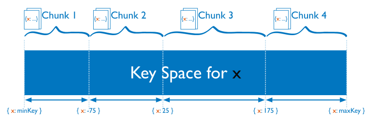
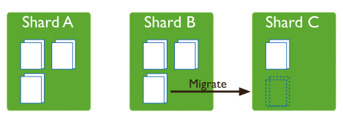
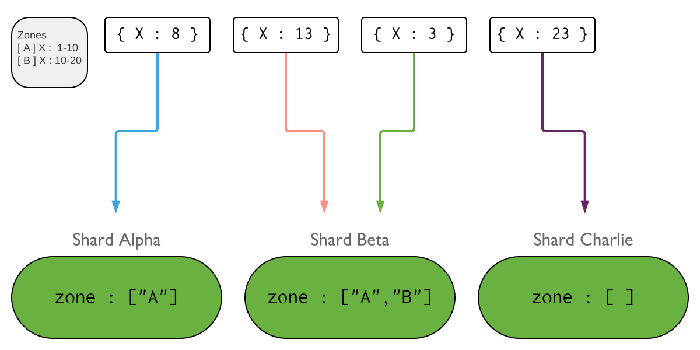
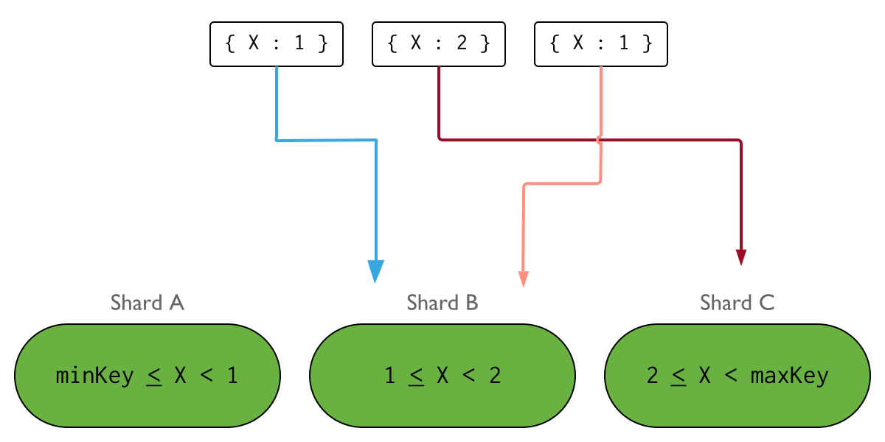
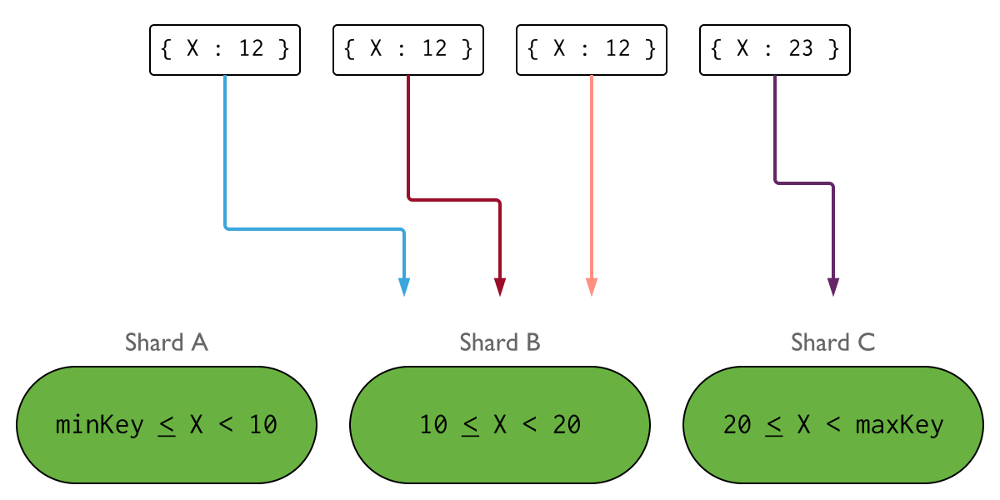
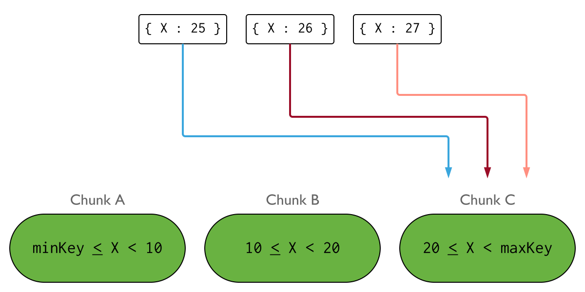
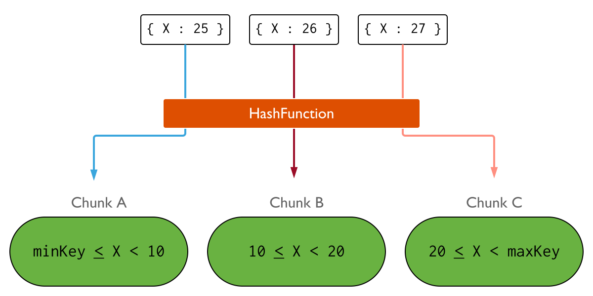

# Отчет по Масштабируемой подсистеме диалогов

## Содержание

1. [ Задача ](#task)
2. [ Инструментарий ](#instruments)
3. [ Почему Mongo? ](#why-mongo)
4. [ Шардирование в Mongo ](#mongo-sharding)
   - [ Архитектура кластера ](#cluster-arch)
   - [ Распределение данных в кластере ](#data-distribution)
   - [ Решардинг ](#resharding)
   - [ Требования к ключу шардирования ](#shared-key-requirements)
5. [ Зашардим уже чего-нибудь! ](#lets-go-shard)
   - [ Настройка окружения ](#setup-env)
   - [ Коллекции данных ](#collections)
      - [ Chats ](#chats-collection)
      - [ Messages ](#messages-collection)
   - [ Выбор ключа шардирования ](#choosing-shared-key)
   - [ Команды запуска ](#startup)
   - [ Процесс инициализации кластера ](#init-cluster)
   - [ Тесты ](#tests)
6. [ Выводы ](#in-total)

<a name="task"></a>

## Задача

1) Создадать базовый скелет микросервиса диалогов;
2) Обеспечить горизонтальное масштабирование хранилищ на запись с помощью шардинга;
3) Предусмотреть возможность решардинга;
4) Предусмотреть “Эффект Леди Гаги” (один пользователь пишет сильно больше среднего).

<a name="instruments"></a>

## Инструментарий

- **Go v1.15.8** язык реализации сервиса дилогов;
- **Mongodb v4.4.3** хранилище данных с возможностью шардирования;
- **Docker-compose** для оркестрации окружения.

<a name="why-mongo"></a>

## Почему Mongo в качетстве хранилища данных?

- Mongo из коробки умеерт в шардинг;
- Из коробки умеет в роутинг данных по шардам;
- Из коробки умеет в решардинг. У монго есть фоновый процесс-балансир, который, при правильно выбранном ключе
  шардирования, равномерно размазывает данные по шардам;
- Легкое, без головной боли добавление новых шардов;
- Стабильное, проверенное временем решение, которое разворачивается без плясок с бубном;
- Леди Гага гасится на дальних подступах, опять же, прямо из коробки;
- Обширный опыт использования в продакшене.

<a name="mongo-sharding"></a>

## Шардирование в Mongo

<a name="cluster-arch"></a>

### Архитектура кластера

Стандартная production архитектура кластера:


Т.к. у нас тут тестовый стенд, то дабы не переусложнять схему, Роутер будет всего один, а реплика Конфиг-сервиса будет
состоять из одной ноды. Такой конфиуграции вполне хватит для демонстрации шардирования в MongoDb.

Общение приложения с шард-серверами идет через Роутер. Изменения в состоянии и архитектуре кластера мониторятся Роутером
через Конфиг Сервер. Так же Конфиг Сервер хранит знания о диапазонах shared key и их связях с шардами.

Шарды же, непосредственно, хранят порционированные наборы данных - фрагменты (chunks).

<a name="data-distribution"></a>

### Распределение данных в кластере

Алокация данных происходит при помощи ключа шардирования - `shared key`.

Множества ключей делятся на диапазоны, за которыми закрепляются наборы данных - `chunks`.



Чанки же, в свою очередь, рапределяются балансировщиком по шардам.

Как только чанк достигает определенного размера (по умолчанию 64Mb), MongoDb пытается разделить его на два фрагмента, с
равными диапазонами ключей (если это возможно), после чего в дело может вступить процесс балансироваки - `Balancer`.

Балансировщик производит миграцию чанков, для выравнивания количества наборов данных между шардами. Пример:



<a name="resharding"></a>

### Решардинг

Под решардингом я понимаю изменение схемы шардирования. Сюда входят:

1. Добавление/Удаление шарда;
2. Изменение ключа шардирования;
3. Изменение принципа распределения данных.

Начнем по порядку:

1. При добалении нового шард-сервера в кластер, Balancer-процесс начнет мигрировать чанки на новый сервер, выравнивая
   распределение данных между шардами. При удалении принцип тот же,- шард будет исключен из кластера, после того как
   балансировщик мигрирует и распределит все данные с удаляемого шарда.
2. MongoDb разрешает добавлять поля в suffix у compound ключа. Но если необходимо сменить prefix или весь ключ целиком,
   то беда.
3. На распределение данных можно дополнительно повлиять при помощи зонирования шардов. Шард закрепляется за зоной или
   несколькими зонами. За зоной закрепляется диапазон shared keys.

Пример зонирования. Зона А представляет диапазон ключей с 1 до 10. Зона В диапазон ключей от 10 до 20. Шарды Alpha и
Beta закреплены за зоной A. Шард Beta также принадлежит зоне B. Шард Charlie не зонирован:



<a name="shared-key-requirements"></a>

### Требования к ключу шардирования

Как можно понять, выбор shared key не всегда тривиальная задача, ибо от него зависит, будут ли данные равномерно
распределенны между шардами, будет ли поиск документов осуществляться на конкретном шарде, или придется делать
широковещательный запрос по всем шард-серверам.

Идеальный shared key отвечает следующим требованиям:

1. Имеет **Высокую cardinality** (селективность или в терминологии множеств - мощность), в противном случае данные будут
   распределяться только по шардам, количество которых не превышает мощность множества ключей шардирования, а добавление
   новых шард-серверов в кластер не привнесёт никакого положительного эффекта.

Пример, мощность множества ключей X[1, 2] равняется двум:



2. Имеет **Низкую частоту**. Т.е. если один и тот же ключ часто встречается в данных, то это приведёт к образованию
   больших неделимых фрагментов данных (chunks) на одном или нескольких шардах, что сильно снизит эффективность кластера
   и сделает невозможным равномерное распределение данных.

Пример распределения данных при высокой частоте ключа:



3. Не является **Монотонновозрастающей** величиной. Например, autoincrement ids или timestamp. В противном случае все
   создаваемые документы будут попадать на один шард, в единный chunk, а балансировщик данных будет работать без
   остановки, чрезмерно утилизируя ресурсы кластера.

Пример распределения данных при монотонновозрастающем ключе:



<a name="lets-go-shard"></a>

## Зашардим уже чего-нибудь

<a name="setup-env"></a>

### Настройка окружения

1. [Конфиг docker-compose](../../docker-compose.dialogue.yml)
2. [Скрипт конфигруации кластера](../../deployment/sharedCluster/setupSharedCluster.sh)

docker-compose запускает

- mongodb cluster, в состав которого входит зоопарк из сервера конфигурации, сервера руотинга и трех шардов, с
  master-slave репликми.
- сервис диалогов, реализующий REST API

Вся магия запуска кластера происходит в сервисе `sharder`.

<a name="collections"></a>

### Коллекции данных

<a name="chats-collection"></a>

#### Chats

**Структура документа:**

```json
{
   "_id": "601eb87efa1a4d54af02bb20",
   "users": [
      1,
      2
   ],
   "ts": 1612626038
}
```

- `_id` - ObjectId идентификатор документа в коллекции;
- `users` - массив с ID участников общения;
- `ts` - timestamp создания чата.

Chat коллекция необходима для группировки и валидации прав доступа к сообщениям чата.

<a name="messages-collection"></a>

#### Messages

**Структура документа:**

```json
{
   "_id": "601eb8aefa1a4d54af02bb21 ",
   "cid": "601eb87efa1a4d54af02bb20",
   "aid": 2,
   "txt": "Hi there!",
   "ts": 1612626038
}
```

- `_id` - ObjectId идентификатор документа в коллекции;
- `сid` - ObjectId идентификатор чата;
- `aid` - идентификатор автора сообщения;
- `ts` - timestamp создания сообщения.

Messages хранит сообщения и связь с чатами.

<a name="choosing-shared-key"></a>

### Выбор ключа шардирования

Итак, нам необходимо решить, что шардировать и как выбрать ключ, который:

1. Относительно равномерно распределит данные между шардами (тем самым поборет эффект Леди Гаги);
2. Исключит "широковещательные" запросы со сбором данных по всем шардам;
3. Даст максимально возможную гарантию нахождения запрашиваемых данных на одном шарде, а при должной удаче и в одном
   фрагменте - чанке.

Количество чатов на первом этапе развития сервиса врятли будет драмматически-огромным. Так что чаты можно или не
шардировать вовсе, или расшардировать их многим позже.

**Шардировать будем сообщения.**

Сообщения всегда будут группироваться и выбираться по чату, с сортировкой по дате создания.

Следовательно, если в качестве ключа шардирования у сообщения выбрать Chat ID, то мы точно не получим "
широковещательный"
запрос, и будем читать данные с одного шарда.

Chat ID уникален, вследствии чего, имеет высокую мощность (cardinality).

Теперь о минусах. Их два и они большие:

1. **Высокая частота**. `Леди Гага` может точечно дать жары в одном или нескольих чатах, что приведёт к образованию
   неделимых чанков (ID чата уникален), и неравномерному распределению данных;
2. ObjectId в MongoDb это **монотонновозрастающее** значение

**Первый минус** можно побороть, сделав ключ составным (compound), добавив туда суфиксом `timestamp` создания сообщения.
Таким образом мы выйдем за диапазон существующих Chat IDs, и получим возможность разбивать чанки сообщени из "толстых"
чатов. Так же при сортировке будет задейстован индекс.

При таком раскладе мы теряем гарантию расположения сообщений чата на одном шарде, т.к. чанк вполне себе может уехать на
другой шард.

Если это критично, то можно извернуться, и добавить в документ сообщения кастомное поле `dt`, которое использовать как
суффикс ключа шардирования, вместо `ts` - timestamp. Далее, в поле `dt` начать писать значение текущего месяца и дня (
без года, дабы не ограничивать выборку 356-ю вариантами). В итоге получим значения вида "12-01".

Для особо болтливых можно в оперативном кэше вести счетчик, сверяя его с определенными лимитами сообщений. При
превышении первого лимита, к значению `dt` в сообщениях "Болтуна" начинаем добавляться текущий час, при превышении
второго лимита докидываем минуты и т.д.

Это позволит выборочно сгладить распределение сообщения по шардам, и несколько снизит ущерб по скорости выборки,
увеличив вероятность расположения сообщений чата на одном шарде.

**Второй минус** - монотонное возрастание идентификатора чата, решается при помощи хэшированного индекса.

Hashed индекс автоматически пропускается через встроенную в MongoDb функцию хэширования. Полученный хэш позволяет
равномерно распределить документы:



К сожалению, я уже не имел достаточно времени для поиграться с объемами и распределением данных, так что не стал
реализовывать в коде счетчики и работу с кастомным
`dt` полем для распределения сообщений "Болтунов", а не мудурствуя лукаво, зашел в лоб, взяв в качестве shared key
композитный индекс по хэшированному Chat ID c timestamp создания сообщения в качестве суффикса:

```json
{
   "cid": "hashed",
   "ts": 1
}
```

<a name="startup"></a>

### Команды запуска

Кластер и диалоговый сервис подымаются командой
> make up TYPE=dialogue

либо
> docker-compose -f docker-compose.dialogue.yml up --build -d

Убедиться, что в логах сервиса `sharder` есть строка "Shared Cluster has been initiated":
> sudo docker logs sharder | grep "Shared Cluster has been initiated"

<a name="init-cluster"></a>

### Процесс инициализации кластера

Инициализация кластера происходит
в [Скрипте конфигруации кластера](../../deployment/sharedCluster/setupSharedCluster.sh)

Здесь я кратко опишу команды инициализации структурных частей кластера, а также команды создания индексов и ключа
шардирования.

1. Инициализируем кластер из запущенных ранее шардов. На мастер ноде каждого шарда исполняем следующие команды:

```js   
rs.initiate({
   _id: "shard01", version: 1, members: [
      {_id: 0, host: "mongo01Mstr:27017"},
      {_id: 1, host: "mongo01Repl:27017"},
   ]
});
// ...
rs.initiate({
   _id: "shardN", version: 1, members: [
      {_id: 0, host: "mongoNMstr:27017"},
      {_id: 1, host: "mongoNRepl:27017"},
   ]
});
```

2. Инициализируем сервер конфигурации, исполняя на его мастер ноде команду:

```js
rs.initiate({
   _id: "configServer",
   configsvr: true, version: 1,
   members: [
      {_id: 0, host: "mongoConfig:27017"}
   ]
})
```

3. Соединяемся с сервером Роутера и показываем, где у нас шарды:

```js
sh.addShard("shard01/mongo01Mstr:27017");
sh.addShard("shard01/mongo01Repl:27017");
// ...
sh.addShard("shardN/mongoNMstr:27017");
sh.addShard("shardN/mongoNRepl:27017");
```

4. Там же включаем шардинг базы данных:

```js
sh.enableSharding("otus_ha")
```

5. Создаем ключ шардирования и индекс по пустой коллекции сообщений:

```js
sh.shardCollection("otus_ha.messages", {"cid": "hashed", "ts": 1})
```

6. Добавляем `multikey` индекс в нешардируемую коллекцию чатов, дабы по нему читать список чатов определенного
   пользователя:

```js
db.getSiblingDB("otus_ha");
db.chats.ensureIndex({"users": 1})
```

Дату создания чата в индекс добавлять не стал, т.к. выборку сортирую по порядку добавления чатов в БД. Можно было
конечно получить "покрывающий" индекс, но на данном этапе я посчитал это избыточным.

7. Проверяем, как поднялся кластер.

Можно прочитать в логах сервиса кластер-стартера:
> sudo docker logs sharder

или в Роутере исполнить команду:
> sh.status()

Получим примерно следующую выдачу:

```
--- Sharding Status --- 
{
...
shards:
   {"_id": "shard01", "host": "shard01/mongo01Mstr:27017,mongo01Repl:27017", "state": 1}
   {"_id": "shard02", "host": "shard02/mongo02Mstr:27017,mongo02Repl:27017", "state": 1}
   {"_id": "shard03", "host": "shard03/mongo03Mstr:27017,mongo03Repl:27017", "state": 1}
active mongoses:
   "4.4.3" : 1
autosplit:
   Currently enabled: yes
balancer:
   Currently enabled:  yes
   ...
databases:
   {"_id": "config", "primary": "config", "partitioned": true}
   {
      "_id": "otus_ha",
      "primary": "shard01",
      "partitioned": true,
      ...   
   }
   otus_ha.messages
      shard key: {"cid": "hashed", "dt" : 1}
      ...
   balancing: true
   chunks:
      shard01	2
      shard02	2
      shard03	2
   {"cid": {"$minKey": 1}, "dt": {"$minKey": 1}} -->> { "cid": ..., "dt": ...}} on : shard01 Timestamp(1, 0)
   ...
   {"cid": ..., "dt": { "$minKey" : 1 } } -->> {"cid" :..., "dt": ...} on : shard03 Timestamp(1, 5)
   ...
```

Что мы в ней видим:

1. Успешно добавлено три шарда с реплика-сетами;
2. В наличии у нас 1 mongos роутер версии 4.4.3;
3. Авторазделение фрагментов данных и балансировка включены;
4. Шардирование включено для базы otus_ha;
5. В качесте primary выбран shard01. Это значит, что все нешардируемые коллекции будут храниться на нем. У нас это
   коллекция чатов;
6. Шардируется коллекция otus_ha.messages, по ключу `{"cid": "hashed", "dt" : 1}`;
7. Первичные диапазоны фрагментов-чанков и их распределение по шардам.

<a name="tests"></a>

### Тесты

Берем из настроек токен авторизации, и шлем запросы на создание чата для различных комбинаций пользователей:
> curl -XPOST http://127.0.0.1:8009/chats -d '{"users":[1, 2]}' -H "Authorization:Bearer SOME_SECRET_TOKEN"

В ответе находим `chat_id` - идентификатор чата, и шлем запросы на создание сообщений:
> curl -XPOST http://127.0.0.1:8009/messages -d '{"user_id":2, "chat_id":"601ebca6a834d8abc568f3c7", "text":"Hi there!"}' -H "Authorization:Bearer SOME_SECRET_TOKEN"

Соединяемся с mongos клиентом на Роутере кластера:

> sudo docker -it mongoRouter mongo --port 27017

или

> mongo --host 127.0.0.1 --port 27117

если в хост системе установлен mongo клиент.

Через explain запросов определяем, как распределились сообщения:

> db.messages.find({cid:ObjectId("601eb87efa1a4d54af02bb20")}).sort({ts: -1}).explain()

```json
{
   "queryPlanner": {
      ...
      "winningPlan": {
         "stage": "SINGLE_SHARD",
         "shards": [
            {
               "shardName": "shard01",
               "connectionString": "shard01/mongo01Mstr:27017,mongo01Repl:27017",
               "namespace": "otus_ha.messages",
               ...
               "winningPlan": {
                  "stage": "SORT",
                  "sortPattern": {
                     "ts": -1
                  },
                  ...
                  "type": "simple",
                  "inputStage": {
                     "stage": "SHARDING_FILTER",
                     "inputStage": {
                        "stage": "FETCH",
                        "filter": {
                           "cid": {
                              "$eq": "601eb87efa1a4d54af02bb20"
                           }
                        },
                        "inputStage": {
                           "stage": "IXSCAN",
                           "keyPattern": {
                              "cid": "hashed",
                              "dt": 1
                           },
                           "indexName": "cid_hashed_dt_1",
                           ...
                        }
                     }
                  }
               }
            },
            ...
         ]
      }
   },
   ...
}
```

> db.messages.find({cid:ObjectId("601ebca1a834d8abc568f3c6")}).sort({ts:1}).explain()

```json
{
   "queryPlanner": {
      "mongosPlannerVersion": 1,
      "winningPlan": {
         "stage": "SINGLE_SHARD",
         "shards": [
            {
               "shardName": "shard03",
               "connectionString": "shard03/mongo03Mstr:27017,mongo03Repl:27017",
               ...
               "winningPlan": {
                  "stage": "SHARDING_FILTER",
                  ...
               }
            }
         ]
      }
   },
   ...
}
```

Видим, что

- данные распределены разным по шардам;
- сообщения одного чата хранятся и читаются в рамках одного шарда;
- по плану запроса индекс задействован для выборки сортировки.

<a name="in-total"></a>

## Выводы

С помощью шардирования данных, можно:

- существенно размазать нагрузку на запись и чтение;
- инкапсулировать данные в определенных регионах и датацентрах.

А можно, на очень долгий срок познакомиться с его Величеством Геморроем, неправильно выбрав ключ шардирования.

Так что рассматривать возможность шардирования данных, я бы рекомендовал к моменту, когда уже собран большой дата-сет, а
также точно определены взаимосвязи данных, их путь от хранилища к потребителю и их трансформации внутри сервисов.